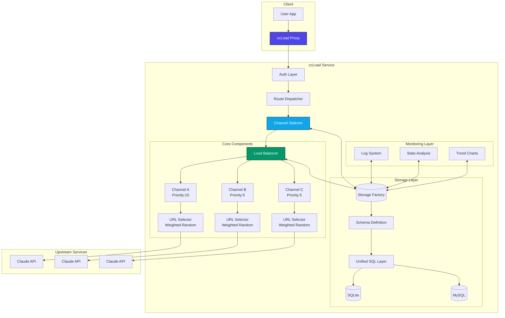

# ccLoad

**AI API gateway for Claude Code, Codex, Gemini, and OpenAI.**

**English | [简体中文](README.zh-CN.md)**

[](https://golang.org)
[](https://github.com/gin-gonic/gin)
[](https://hub.docker.com)
[](https://huggingface.co/spaces)
[](https://github.com/features/actions)
[](LICENSE)

> Smart routing | Automatic failover | Exponential cooldown | Multi-URL scheduling | Protocol transforms | Live monitoring | Cost control

ccLoad removes the operational mess of running multiple AI API upstreams. It keeps Claude Code, Codex, Gemini, and OpenAI-compatible clients on one stable gateway, then handles upstream selection, failover, cooldown, protocol conversion, request visibility, and cost limits in the service instead of in every client script.

## 🎯 What ccLoad Solves

Common failure modes when you run several AI API channels:

- **Manual channel switching**: Different keys, validity windows, quotas, and upstream URLs quickly become hard to manage.
- **Rate limits and upstream failures**: `429`, `502`, `504`, expired keys, and overloaded providers should not stop the client workflow.
- **Opaque request status**: Without live request visibility, long streaming requests become guesswork.
- **HTTP 200 with error content**: Some upstreams return a successful HTTP status while the response body is an actual error.
- **Cost drift**: Shared gateways need per-channel and per-token limits, not spreadsheet accounting after the bill arrives.

ccLoad handles those cases with:

- **Smart routing**: High-priority channels are selected first; channels at the same priority use smooth weighted round-robin.
- **Automatic failover**: Failed keys, channels, and URLs are skipped according to the classified error type.
- **Exponential cooldown**: Unhealthy upstreams back off automatically instead of being hammered by retries.
- **Multi-URL scheduling**: A single channel can use multiple upstream URLs, weighted by observed latency and health.
- **Protocol transforms**: Anthropic, OpenAI, Gemini, and Codex request/response families can be converted at the gateway.
- **Live monitoring**: Active requests, logs, token usage, TTFB, cost, and upstream details are visible in the web dashboard.
- **Soft-error detection**: HTTP 200 responses that are actually errors trigger the same failover path as regular upstream failures. Common cases include:
  - JSON responses containing `{"error": {...}}` structure
  - Responses with `type` field set to `"error"`
  - Explicit rate limits in SSE `error` events (`rate_limit_exceeded` / `too_many_requests`) are handled as `429`
  - Plain text messages like `"当前模型负载过高"` / `"Current model load too high"` (load warnings)

## ✨ Key Features

- 🚀 **High-Performance Architecture** - Gin framework, 1000+ concurrent connections, high-performance caching
- 🧮 **Local Token Counting** - API-compliant local token estimation, <5ms response, 93%+ accuracy, supports large-scale tool scenarios
- 🎯 **Smart Error Classification** - Distinguishes Key/Channel/Client errors, soft error detection (200 masquerading as error), SSE rate-limit errors as 429, 1308 quota handling
- 🔀 **Smart Routing** - Priority + smooth weighted round-robin channel selection, **pre-filters cooled channels**, multi-key load balancing, **health-based dynamic sorting** (confidence factor prevents small sample over-penalization)
- 🛡️ **Failover** - Automatic failure detection with exponential backoff cooldown (1s → 2s → 4s → ... → 30min)
- 🔒 **Race-Safe** - Key selector race condition protection, startup config validation, automatic resource cleanup
- 📊 **Real-time Monitoring** - Built-in trend analysis, logging, and stats dashboard, **Token usage stats** with time range selection and per-token classification
- 🎯 **Transparent Proxy** - Supports Claude Code, Codex, Gemini, and OpenAI compatible APIs with smart auth detection
- 📦 **Single Binary Deployment** - No external dependencies, embedded SQLite included
- 🔒 **Secure Authentication** - Token-based admin interface and API access control
- 🏷️ **Build Tags** - GOTAGS support, high-performance JSON library enabled by default
- 🐳 **Docker Support** - Multi-arch images (amd64/arm64), automated CI/CD
- ☁️ **Cloud Native** - Container deployment support, GitHub Actions auto-build
- 🤗 **Hugging Face** - One-click deployment to Hugging Face Spaces, free hosting
- 💰 **Cost Limits** - Per-channel daily cost limits, per-token cost limits
- 🚦 **Channel RPM Limits** - Per-channel rolling 60-second request caps, 0=unlimited
- 🚧 **Channel Concurrency Limits** - Per-channel in-flight request caps, 0=unlimited
- 🔐 **Token Restrictions** - API token cost limits + model restrictions for fine-grained access control
- ⏱️ **TTFB Monitoring** - Streaming request first byte time tracking for upstream latency diagnosis
- 🌐 **Multi-URL Load Balancing** - Multiple URLs per channel with latency-weighted random selection
- 💵 **service_tier Pricing** - OpenAI priority/flex/default tier multipliers for accurate cost accounting
- 🖼️ **Image Tool Billing** - Responses image_generation/gpt-image-2 cost accounting
- 📉 **Tiered Pricing** - GPT-5.4/Qwen-Plus/Gemini long-context step pricing, auto-applies lower rate at token thresholds
- 🔄 **Protocol Transform** - Anthropic/OpenAI/Gemini/Codex cross-protocol conversion, preserving sampling and thinking parameters so one channel serves multiple client protocols
- 🔍 **Debug Logs** - Upstream request/response raw data capture with sensitive header masking, essential for troubleshooting
- 🕐 **Scheduled Checks** - Background periodic channel availability probing, auto-detect failed channels
- 🧩 **Custom Request Rules** - Per-channel HTTP header & JSON body rewriting (remove/override/append), with auth header protection, CRLF guard, and capacity caps
- 🎛️ **Log Column Customization** - Show/hide table columns per preference, settings persist in browser localStorage

## 🏗️ Architecture Overview



## 🚀 Quick Start

Choose the deployment method that suits you best:

| Method | Difficulty | Cost | Use Case | HTTPS | Persistence |
|--------|------------|------|----------|-------|-------------|
| 🐳 **Docker** | ⭐⭐ | VPS required | Production, high performance | Config required | ✅ |
| 🤗 **Hugging Face** | ⭐ | **Free** | Personal use, quick trial | ✅ Auto | ✅ |
| 🔧 **Source Build** | ⭐⭐⭐ | Server required | Development, customization | Config required | ✅ |
| 📦 **Binary** | ⭐⭐ | Server required | Lightweight, simple setup | Config required | ✅ |

### Method 1: Docker Deployment (Recommended)

**Using pre-built images (Recommended)**:
```bash
# Option 1: Using docker-compose (Simplest)
curl -o docker-compose.yml https://raw.githubusercontent.com/caidaoli/ccLoad/master/docker-compose.yml
curl -o .env https://raw.githubusercontent.com/caidaoli/ccLoad/master/.env.example
# Edit .env file to set password
docker-compose up -d

# Option 2: Run image directly
docker pull ghcr.io/caidaoli/ccload:latest
docker run -d --name ccload \
  -p 8080:8080 \
  -e CCLOAD_PASS=your_secure_password \
  -v ccload_data:/app/data \
  ghcr.io/caidaoli/ccload:latest
```

**Building from source**:
```bash
# Clone project
git clone https://github.com/caidaoli/ccLoad.git
cd ccLoad

# Build and run with docker-compose
docker-compose -f docker-compose.build.yml up -d

# Or build manually
docker build -t ccload:local .
docker run -d --name ccload \
  -p 8080:8080 \
  -e CCLOAD_PASS=your_secure_password \
  -v ccload_data:/app/data \
  ccload:local
```

### Method 2: Source Build

```bash
# Clone project
git clone https://github.com/caidaoli/ccLoad.git
cd ccLoad

# Build project (uses high-performance JSON library by default)
go build -tags sonic -o ccload .

# Or use Makefile
make build

# Run in development mode
go run -tags sonic .
# Or
make dev
```

### Method 3: Binary Download

```bash
# Download binary for your platform from GitHub Releases
wget https://github.com/caidaoli/ccLoad/releases/latest/download/ccload-linux-amd64
chmod +x ccload-linux-amd64
./ccload-linux-amd64
```

### Method 4: Hugging Face Spaces Deployment

Hugging Face Spaces provides free container hosting with Docker support, ideal for personal and small team use.

#### Deployment Steps

1. **Login to Hugging Face**

   Visit [huggingface.co](https://huggingface.co) and log into your account

2. **Create New Space**

   - Click "New" → "Space" in the top right
   - **Space name**: `ccload` (or custom name)
   - **License**: `MIT`
   - **Select the SDK**: `Docker`
   - **Visibility**: `Public` or `Private` (private requires paid subscription)
   - Click "Create Space"

3. **Create Dockerfile**

   Create a `Dockerfile` in the Space repository:

   ```dockerfile
   FROM ghcr.io/caidaoli/ccload:latest
   ENV TZ=Asia/Shanghai
   ENV PORT=7860
   ENV SQLITE_PATH=/tmp/ccload.db
   EXPOSE 7860
   ```

   Create via:

   **Method A - Web Interface** (Recommended):
   - Click "Files" tab on Space page
   - Click "Add file" → "Create a new file"
   - Enter `Dockerfile` as filename
   - Paste the content above
   - Click "Commit new file to main"

   **Method B - Git Command Line**:
   ```bash
   # Clone your Space repository
   git clone https://huggingface.co/spaces/YOUR_USERNAME/ccload
   cd ccload

   # Create Dockerfile
   cat > Dockerfile << 'EOF'
   FROM ghcr.io/caidaoli/ccload:latest
   ENV TZ=Asia/Shanghai
   ENV PORT=7860
   ENV SQLITE_PATH=/tmp/ccload.db
   EXPOSE 7860
   EOF

   # Commit and push
   git add Dockerfile
   git commit -m "Add Dockerfile for ccLoad deployment"
   git push
   ```

4. **Configure Environment Variables (Secrets)**

   In Space settings (Settings → Variables and secrets → New secret):

   | Variable | Value | Required | Description |
   |----------|-------|----------|-------------|
   | `CCLOAD_PASS` | `your_admin_password` | ✅ **Required** | Admin interface password |
   | `CCLOAD_API_TOKENS` | `token1\|production,token2\|development` | Optional | Pre-seed API access tokens on startup |

   **Note**: API access tokens can be pre-seeded with `CCLOAD_API_TOKENS` or managed in the Web admin interface `/web/tokens.html`.

5. **Wait for Build and Startup**

   After pushing Dockerfile, Hugging Face will automatically:
   - Pull pre-built image (~30 seconds)
   - Start application container (~10 seconds)
   - Total time ~1-2 minutes (3-5x faster than source build)

6. **Access Application**

   After build completes, access via:
   - **App URL**: `https://YOUR_USERNAME-ccload.hf.space`
   - **Admin Interface**: `https://YOUR_USERNAME-ccload.hf.space/web/`
   - **API Endpoint**: `https://YOUR_USERNAME-ccload.hf.space/v1/messages`

   **First Access Note**:
   - If Space is sleeping, first access takes 20-30 seconds to wake
   - Subsequent accesses respond immediately

#### Hugging Face Deployment Characteristics

**Advantages**:
- ✅ **Completely Free**: Public Spaces are permanently free with CPU and storage
- ✅ **Fast Deployment**: Pre-built image, 1-2 minutes (3-5x faster than source build)
- ✅ **Auto HTTPS**: No SSL certificate configuration needed
- ✅ **Auto Restart**: Automatic restart after crashes
- ✅ **Version Control**: Git-based, easy rollback and collaboration
- ✅ **Simple Maintenance**: Only 5-line Dockerfile, no source code management

**Limitations**:
- ⚠️ **Resource Limits**: Free tier provides 2 CPU + 16GB RAM
- ⚠️ **Sleep Policy**: 48 hours without access triggers sleep, first access takes ~20-30s to wake
- ⚠️ **Fixed Port**: Must use port 7860
- ⚠️ **Public Access**: Spaces are public by default, must configure API tokens via Web admin to access /v1/* APIs (otherwise 401)

#### Data Persistence

**Important**: Hugging Face Spaces Storage Policy

Due to Hugging Face Spaces limitations (`/tmp` directory clears on restart), **we strongly recommend using an external MySQL database** for complete data persistence:

**Option 1: Hybrid Storage Mode (Recommended, Best Performance)**
- ✅ **Ultra-fast queries**: All reads/writes go through local SQLite, latency <1ms (free MySQL has 800ms+ latency)
- ✅ **Restart-safe**: Async sync to MySQL, auto-restore on startup
- ✅ **Stats caching**: Smart TTL cache reduces repetitive aggregate queries
- Configuration: Add `CCLOAD_MYSQL` + `CCLOAD_ENABLE_SQLITE_REPLICA=1` in Secrets

**Dockerfile Example (Hybrid Mode)**:
```dockerfile
FROM ghcr.io/caidaoli/ccload:latest
ENV TZ=Asia/Shanghai
ENV PORT=7860
# Configure in Secrets: CCLOAD_MYSQL + CCLOAD_ENABLE_SQLITE_REPLICA=1
EXPOSE 7860
```

**Option 2: Pure MySQL Mode**
- ✅ **Complete Persistence**: Channel configs, logs, and stats all preserved
- ✅ **Restart-Safe**: Data stored externally, unaffected by Space restarts
- ⚠️ **Slower Queries**: Free MySQL has higher latency, stats pages respond slowly
- Configuration: Add `CCLOAD_MYSQL` environment variable in Secrets

**Recommended Free MySQL Services**:
- [TiDB Cloud Serverless](https://tidbcloud.com/) - Free 5GB storage, MySQL compatible, no connection limits, recommended first choice
- [Aiven for MySQL](https://aiven.io/) - Free 1GB storage, multi-region support

**MySQL Configuration Example (TiDB Cloud)**:
1. Register for [TiDB Cloud](https://tidbcloud.com/) account
2. Create Serverless Cluster (free)
3. Get connection info, format: `user:password@tcp(host:4000)/database?tls=true`
4. Add `CCLOAD_MYSQL` variable in Hugging Face Space Secrets
5. **(Optional) Enable Hybrid Mode**: Add `CCLOAD_ENABLE_SQLITE_REPLICA=1` for best performance
6. Restart Space, all data will auto-persist to MySQL

**Dockerfile Example (Pure MySQL)**:
```dockerfile
FROM ghcr.io/caidaoli/ccload:latest
ENV TZ=Asia/Shanghai
ENV PORT=7860
# No SQLITE_PATH needed, uses CCLOAD_MYSQL environment variable
EXPOSE 7860
```

**Option 3: Local Storage Only (Not Recommended)**
- ⚠️ **Data Loss**: `/tmp` clears on Space restart, channel config lost
- ⚠️ **Manual Recovery**: Must re-import via Web interface or CSV
- Use case: Temporary testing only

#### Update Deployment

With pre-built images, updates are simple:

**Auto Update**:
- When new version image (`ghcr.io/caidaoli/ccload:latest`) is released
- Click "Factory rebuild" in Space settings to pull latest image
- Or wait for Hugging Face auto-restart (typically after 48 hours)

**Manual Trigger Update**:
```bash
# Add empty commit to trigger rebuild
git commit --allow-empty -m "Trigger rebuild to pull latest image"
git push
```

**Version Pinning** (Optional):
To lock specific version, modify Dockerfile:
```dockerfile
FROM ghcr.io/caidaoli/ccload:2.19.0  # Specify version
ENV TZ=Asia/Shanghai
ENV PORT=7860
ENV SQLITE_PATH=/tmp/ccload.db
EXPOSE 7860
```

### Basic Configuration

**SQLite Mode (Default)**:
```bash
# Set environment variables
export CCLOAD_PASS=your_admin_password
export PORT=8080
export SQLITE_PATH=./data/ccload.db

# Or use .env file
echo "CCLOAD_PASS=your_admin_password" > .env
echo "PORT=8080" >> .env
echo "SQLITE_PATH=./data/ccload.db" >> .env

# Start service
./ccload
```

**MySQL Mode**:
```bash
# 1. Create MySQL database
mysql -u root -p -e "CREATE DATABASE ccload CHARACTER SET utf8mb4 COLLATE utf8mb4_unicode_ci;"

# 2. Set environment variables
export CCLOAD_PASS=your_admin_password
export CCLOAD_MYSQL="user:password@tcp(localhost:3306)/ccload?charset=utf8mb4"
export PORT=8080

# Or use .env file
echo "CCLOAD_PASS=your_admin_password" > .env
echo "CCLOAD_MYSQL=user:password@tcp(localhost:3306)/ccload?charset=utf8mb4" >> .env
echo "PORT=8080" >> .env

# 3. Start service (auto-creates tables)
./ccload
```

**Docker + MySQL**:
```bash
# Option 1: docker-compose (Recommended)
cat > docker-compose.mysql.yml << 'EOF'
version: '3.8'
services:
  mysql:
    image: mysql:8.0
    environment:
      MYSQL_ROOT_PASSWORD: rootpass
      MYSQL_DATABASE: ccload
      MYSQL_USER: ccload
      MYSQL_PASSWORD: ccloadpass
    volumes:
      - mysql_data:/var/lib/mysql
    ports:
      - "3306:3306"
    healthcheck:
      test: ["CMD", "mysqladmin", "ping", "-h", "localhost"]
      interval: 10s
      timeout: 5s
      retries: 5

  ccload:
    image: ghcr.io/caidaoli/ccload:latest
    environment:
      CCLOAD_PASS: your_admin_password
      CCLOAD_MYSQL: "ccload:ccloadpass@tcp(mysql:3306)/ccload?charset=utf8mb4"
      PORT: 8080
    ports:
      - "8080:8080"
    depends_on:
      mysql:
        condition: service_healthy

volumes:
  mysql_data:
EOF

docker-compose -f docker-compose.mysql.yml up -d

# Option 2: Direct run (requires existing MySQL service)
docker run -d --name ccload \
  -p 8080:8080 \
  -e CCLOAD_PASS=your_admin_password \
  -e CCLOAD_MYSQL="user:pass@tcp(mysql_host:3306)/ccload?charset=utf8mb4" \
  ghcr.io/caidaoli/ccload:latest
```

After service starts, access:
- Admin Interface: `http://localhost:8080/web/`
- API Proxy: `POST http://localhost:8080/v1/messages`
- **API Token Management**: `http://localhost:8080/web/tokens.html` - Configure API access tokens via Web interface

## 📖 Usage Guide

### API Proxy

**Claude API Proxy (Requires Auth)**:

First, configure API access token in Web admin interface `http://localhost:8080/web/tokens.html`, then use that token to access API:

```bash
curl -X POST http://localhost:8080/v1/messages \
  -H "Content-Type: application/json" \
  -H "Authorization: Bearer your-api-token" \
  -H "x-api-key: your-claude-api-key" \
  -H "anthropic-version: 2023-06-01" \
  -d '{
    "model": "claude-sonnet-4-6",
    "max_tokens": 1024,
    "messages": [
      {
        "role": "user",
        "content": "Hello, Claude!"
      }
    ]
  }'
```

**OpenAI Compatible API Proxy (Chat Completions)**:

```bash
curl -X POST http://localhost:8080/v1/chat/completions \
  -H "Content-Type: application/json" \
  -H "Authorization: Bearer your-api-token" \
  -d '{
    "model": "gpt-4o",
    "messages": [
      {
        "role": "user",
        "content": "Hello!"
      }
    ]
  }'
```

### Local Token Counting

Quickly estimate request token consumption (no upstream API call needed):

```bash
curl -X POST http://localhost:8080/v1/messages/count_tokens \
  -H "Content-Type: application/json" \
  -d '{
    "model": "claude-sonnet-4-6",
    "messages": [
      {"role": "user", "content": "Hello, how are you?"}
    ],
    "system": "You are a helpful assistant."
  }'

# Response example
# {
#   "input_tokens": 28
# }
```

**Features**:
- ✅ Compliant with Anthropic official API spec
- ✅ Local computation, <5ms response, no API quota consumption
- ✅ 93%+ accuracy (compared to official API)
- ✅ Supports system prompts, tool definitions, large-scale tool scenarios
- ✅ Requires auth token (configure at `/web/tokens.html`)

### Channel Management

Manage channels via Web interface `/web/channels.html` or API:

```bash
# Add channel (supports multiple URLs, comma-separated)
curl -X POST http://localhost:8080/admin/channels \
  -H "Content-Type: application/json" \
  -d '{
    "name": "Claude-API",
    "api_key": "sk-ant-api03-xxx",
    "url": "https://api.anthropic.com,https://api2.anthropic.com",
    "priority": 10,
    "rpm_limit": 0,
    "max_concurrency": 0,
    "models": ["claude-sonnet-4-6", "claude-opus-4-6"],
    "enabled": true
  }'
```

> **Multi-URL Note**: The `url` field supports comma-separated multiple URLs. The system uses latency-weighted random selection for optimal URL choice, with automatic cooldown for failed URLs, enabling URL-level load balancing and failover within a single channel.

> **RPM Limit Note**: `rpm_limit` is a per-channel request cap over a rolling 60-second window; `0` means unlimited. Proxy forwarding, manual tests, single-URL tests, and scheduled checks all count toward the cap. Multi-URL failover counts each actual upstream HTTP request. The counter is in-memory: restart clears it, and multiple instances count independently.

> **Concurrency Limit Note**: `max_concurrency` is a per-channel cap on simultaneous in-flight upstream requests; `0` means unlimited. A slot is acquired before the upstream request starts and released when the response body is closed, so streaming requests hold the slot until the stream ends. Over-limit channels are skipped without cooldown. The counter is in-memory and per instance.

### Custom Request Rules (Advanced)

The "Advanced" button in the channel editor opens a secondary modal that lets you rewrite the **HTTP headers** and **JSON request body** forwarded upstream at channel granularity. Typical use cases include `User-Agent` override, forcing API version headers, or tweaking fields like `thinking` / `max_tokens`. Rules apply in configured order and take effect for all subsequent requests on that channel as soon as they are saved.

**Action matrix**:

| Target | `remove` | `override` | `append` |
|---|---|---|---|
| HTTP Header | Delete the named header (supports token-level removal on multi-value headers such as `Anthropic-Beta`) | `Header.Set` replaces all values | `Header.Add` appends a value (multi-value semantics) |
| JSON Body | Delete a field/array element by dotted path | Set the value at a path, creating intermediate nodes as needed | Not supported (ambiguous in JSON) |

**JSON path syntax**:
- Dotted path + numeric array index: `thinking.budget_tokens`, `messages.0.role`, `generation_config.temperature`
- Values accept any JSON literal: number `0.7`, boolean `true`, string `"claude-opus-4-6"`, object `{"type":"adaptive"}`, array `["a","b"]`

**Safety constraints** (hard-enforced server-side even if the frontend is bypassed):
- **Auth header blacklist**: any rule targeting `Authorization`, `x-api-key`, or `x-goog-api-key` (case-insensitive) is silently ignored and logged via `slog.Warn`
- **CRLF injection guard**: header names/values must not contain `\r\n`
- **Non-JSON body passthrough**: requests without `application/json` content type, empty bodies, or bodies that fail to deserialize are forwarded untouched without blocking
- **Capacity caps**: ≤ 32 header rules and ≤ 32 body rules per channel, each value ≤ 8 KB; violations return HTTP 400

**Typical example**:
```jsonc
{
  "custom_request_rules": {
    "headers": [
      { "action": "override", "name": "User-Agent", "value": "claude-cli/1.0 (custom)" },
      { "action": "remove",   "name": "Anthropic-Beta", "value": "context-1m-2025-08-07" },
      { "action": "append",   "name": "Accept", "value": "application/json" }
    ],
    "body": [
      { "action": "override", "path": "thinking", "value": {"type":"adaptive"} },
      { "action": "override", "path": "max_tokens", "value": 4096 },
      { "action": "remove",   "path": "stop_sequences" }
    ]
  }
}
```

> **Interaction with built-in logic**: Custom rules run **after** the anyrouter `anthropic-beta` injection, so they can override or remove the beta flag. The anyrouter adaptive-thinking injection detects a user-provided `thinking` field and leaves it untouched. Authentication headers remain unmodifiable at all times.

### Batch Data Management

Supports CSV format for channel config import/export:

**Export Config**:
```bash
# Web interface: Visit /web/channels.html, click "Export CSV" button
# API call:
curl -H "Authorization: Bearer your_token" \
  http://localhost:8080/admin/channels/export > channels.csv
```

**Import Config**:
```bash
# Web interface: Visit /web/channels.html, click "Import CSV" button
# API call:
curl -X POST -H "Authorization: Bearer your_token" \
  -F "file=@channels.csv" \
  http://localhost:8080/admin/channels/import
```

**CSV Format Example**:
```csv
name,api_key,url,priority,models,enabled
Claude-API-1,sk-ant-xxx,https://api.anthropic.com,10,"[\"claude-sonnet-4-6\"]",true
Claude-API-2,sk-ant-yyy,https://api.anthropic.com,5,"[\"claude-opus-4-6\"]",true
```

**Features**:
- Auto column name mapping (Chinese/English)
- Smart data validation with error messages
- Incremental import and overwrite update
- UTF-8 encoding, Excel compatible

## 📊 Monitoring Metrics

Check out the awesome admin dashboard 👇


*Real-time Monitoring Dashboard: Claude Code, Codex, OpenAI, and Gemini platform metrics at a glance*

**Core Features**:
- 📈 **24-hour Trend Charts** - Request volumes clearly visualized with peaks and valleys
- 🔴 **Real-time Error Logs** - Instantly detect which channel has issues
- 📊 **Channel Call Statistics** - See which channels are performing well with data-backed insights
- ⚡ **Performance Metrics** - Latency, success rates, and bottleneck detection
- 💰 **Token Usage Stats** - Know exactly where your budget goes:
  - Custom time range selector for flexible analysis
  - Per API token ID classification for multi-tenant billing
  - Supports Gemini/OpenAI cache token visualization

- 🎛️ **Log Column Customization** - Click the gear icon to show/hide columns, settings auto-saved to browser

**UI Highlights**:
- 🎨 Modern gradient purple theme for comfortable viewing
- 📱 Responsive design works great on mobile and desktop
- ⚡ Real-time data refresh without manual page reload
- 📊 Multi-dimensional stat cards show key metrics on one screen
  - Cached query optimization
  - Gemini/OpenAI Cache Token (Cache Read) display

## 🔧 Tech Stack

### Core Dependencies

| Component | Version | Purpose | Performance Advantage |
|-----------|---------|---------|----------------------|
| **Go** | 1.25.0+ | Runtime | Native concurrency, built-in min function |
| **Gin** | v1.12.0 | Web Framework | High-performance HTTP routing |
| **modernc/sqlite** | v1.51.0 | Embedded Database | Pure Go, zero CGO dependency, single file (default) |
| **MySQL** | v1.10.0 | RDBMS | Optional, for high-concurrency production |
| **Sonic** | v1.15.1 | JSON Library | 2-3x faster than stdlib |
| **godotenv** | v1.5.1 | Env Config | Simplified config management |

### Architecture Features

**Modular Architecture**:
- **Proxy Module Split** (SRP):
  - `proxy_handler.go`: HTTP entry, concurrency control, route selection
  - `proxy_forward.go`: Core forwarding logic, request building, response handling
  - `proxy_error.go`: Error handling, cooldown decisions, retry logic
  - `proxy_util.go`: Constants, type definitions, utility functions
  - `proxy_stream.go`: Streaming responses, first byte detection
  - `proxy_gemini.go`: Gemini API special handling
  - `proxy_sse_parser.go`: SSE parser (defensive handling, Gemini/OpenAI cache token parsing)
  - `proxy_debug.go`: Upstream request/response debug capture (with sensitive header masking)
- **Admin Module Split** (SRP):
  - `admin_channels.go`: Channel CRUD
  - `admin_stats.go`: Stats analysis API
  - `admin_cooldown.go`: Cooldown management API
  - `admin_csv.go`: CSV import/export
  - `admin_types.go`: Admin API type definitions
  - `admin_auth_tokens.go`: API access token CRUD (with token stats, cost limits, model restrictions)
  - `admin_settings.go`: System settings management
  - `admin_models.go`: Model list management
  - `admin_testing.go`: Channel testing (with protocol transform testing)
  - `admin_debug_log.go`: Debug log API (sensitive header masking + base64 binary encoding)
  - `channel_check_scheduler.go`: Scheduled channel check scheduler
  - `detection_log.go`: Detection result to LogEntry builder
- **Protocol Transform System** (2026-04 new):
  - `protocol/types.go`: Four protocol definitions (Anthropic/OpenAI/Gemini/Codex)
  - `protocol/registry.go`: Request/response transformer registry
  - `protocol/builtin/`: 18 built-in transform implementations (streaming and non-streaming)
  - Preserves sampling/limit/stop/seed parameters; Gemini `thinkingConfig.thinkingLevel` maps to the target protocol's reasoning/thinking config
  - Two modes: `upstream` (default, handled natively by upstream) / `local` (local translation)
  - Channel config: `ProtocolTransformMode` + `ProtocolTransforms`
- **Cooldown Manager** (DRY):
  - `cooldown/manager.go`: Unified cooldown decision engine
  - Eliminates duplicate code, unified cooldown logic
  - Distinguishes network vs HTTP error classification
  - Recognizes structured quota/model cooldown responses and cools down until the upstream reset time
  - Built-in single-key channel auto-upgrade logic
- **Multi-URL Selector** (URLSelector):
  - `url_selector.go`: Smart URL selection within a single channel
  - Explore-first: Unvisited URLs get priority to collect latency data
  - Weighted random: Weight = 1/EWMA latency, lower latency = higher selection probability
  - Independent cooldown: Failed URLs cool down independently without affecting other URLs
  - BaseURL tracking: Active requests, logs, and UI carry upstream URL throughout
- **Storage Layer Refactor** (2025-12 optimization, eliminated 467 lines of duplicate code):
  - `storage/schema/`: Unified schema definition (supports SQLite/MySQL differences)
  - `storage/sql/`: Common SQL implementation layer (SQLite/MySQL shared)
  - `storage/factory.go`: Factory pattern auto-selects database
  - Composite index optimization, stats query performance improved
- **OpenAI service_tier Pricing** (2026-03 new):
  - `util.OpenAIServiceTierMultiplier()`: Returns multiplier for priority/flex/default tiers
  - `LogEntry.ServiceTier`: Persisted to database, log cost column shows tier annotation
  - Supports GPT-5.4, GPT-5.4-pro, and other latest model pricing
- **Responses image_generation Tool Billing** (2026-05 new):
  - Parses Responses API `tool_usage.image_gen` and the `image_generation` tool model
  - Bills `gpt-image-2` by text input, image input, and image output tokens
  - Streaming/non-streaming proxy paths and channel tests share the same usage parser to keep cost accounting consistent
- **Tiered Pricing**:
  - GPT-5.4: Input price auto-steps down after token threshold
  - Qwen-Plus: Lower price tier kicks in after threshold
  - Gemini long-context: Price doubles above threshold
  - Cache discounts: Claude/Opus independent multipliers, OpenAI cache hit 50% discount

**Multi-level Cache System**:
- Channel config cache (60s TTL)
- Round-robin pointer cache (in-memory)
- Cooldown state inline (channels/api_keys tables store directly)
- Error classification cache (1000 capacity)

**Async Processing Architecture**:
- Log system (1000 buffer + single worker, guarantees FIFO order)
- Token/log cleanup (background goroutine, periodic maintenance)

**Unified Response System**:
- `StandardResponse[T]` generic struct (DRY)
- `ResponseHelper` utility class with 9 shortcut methods
- Auto-extracts app-level error codes, unified JSON format

**Connection Pool Optimization**:
- SQLite: 10 connections for memory mode / 5 for file mode, 5-minute lifetime
- HTTP client: 100 max connections, 30s timeout, keepalive optimization
- TLS: Session cache (1024 capacity), reduces handshake latency

## 🔧 Configuration

### Environment Variables

| Variable | Default | Description |
|----------|---------|-------------|
| `CCLOAD_PASS` | None | Admin password (**Required**, exits if not set) |
| `CCLOAD_API_TOKENS` | None | Pre-seed API access tokens on startup. Format: `token1,token2` or `token1\|production,token2\|development`; existing tokens are not overwritten |
| `API_TOKENS` | None | Compatibility alias for `CCLOAD_API_TOKENS`; startup fails if both variables are set with different values |
| `CCLOAD_MYSQL` | None | MySQL DSN (optional, format: `user:pass@tcp(host:port)/db?charset=utf8mb4`)<br/>**If set uses MySQL, otherwise SQLite** |
| `CCLOAD_ENABLE_SQLITE_REPLICA` | `0` | Hybrid storage mode switch (`1`=enable, see below) |
| `CCLOAD_SQLITE_LOG_DAYS` | `7` | Days of logs to restore from MySQL on startup in hybrid mode (-1=all, 0=no logs) |
| `CCLOAD_ALLOW_INSECURE_TLS` | `0` | Disable upstream TLS cert validation (`1`=enable; ⚠️for troubleshooting/controlled intranet only) |
| `PORT` | `8080` | Service port |
| `GIN_MODE` | `release` | Run mode (`debug`/`release`) |
| `GIN_LOG` | `true` | Gin access log switch (`false`/`0`/`no`/`off` to disable) |
| `TRUSTED_PROXIES` | Private ranges + Loopback + `100.64.0.0/10` | Trusted proxy CIDRs (comma-separated); `none` = trust no proxies |
| `SQLITE_PATH` | `data/ccload.db` | SQLite database file path (SQLite mode only) |
| `SQLITE_JOURNAL_MODE` | `WAL` | SQLite Journal mode (WAL/TRUNCATE/DELETE, recommend TRUNCATE for containers) |
| `CCLOAD_MAX_CONCURRENCY` | `1000` | Max concurrent requests (limits simultaneous proxy requests) |
| `CCLOAD_MAX_BODY_BYTES` | `10485760` | Max request body bytes (10MB, Images API auto-expands to 20MB) |
| `CCLOAD_COOLDOWN_AUTH_SEC` | `300` | Auth error (401/402/403) initial cooldown (seconds) |
| `CCLOAD_COOLDOWN_SERVER_SEC` | `120` | Server error (5xx) initial cooldown (seconds) |
| `CCLOAD_COOLDOWN_TIMEOUT_SEC` | `60` | Timeout error (597/598) initial cooldown (seconds) |
| `CCLOAD_COOLDOWN_RATE_LIMIT_SEC` | `60` | Rate limit error (429) initial cooldown (seconds) |
| `CCLOAD_COOLDOWN_MAX_SEC` | `1800` | Exponential backoff cooldown max (seconds, 30 minutes) |
| `CCLOAD_COOLDOWN_MIN_SEC` | `10` | Exponential backoff cooldown min (seconds) |

> If the service sits behind a reverse proxy or load balancer, set `TRUSTED_PROXIES` explicitly so spoofed `X-Forwarded-For` values cannot affect client IP detection or login rate limiting.

#### Hybrid Storage Mode (MySQL Primary + SQLite Cache)

HuggingFace Spaces and similar environments lose local data on restart, but free MySQL has high query latency (800ms+). Hybrid mode offers the best of both worlds:

- **MySQL Primary Storage**: Write operations go to MySQL first, ensuring data persistence
- **SQLite Local Cache**: Read operations go through local SQLite, latency <1ms
- **Startup Recovery**: Restore data from MySQL to SQLite, supports restoring logs by days
- **Log Special Handling**: Write to SQLite first (fast), then async sync to MySQL (backup)

```bash
# Enable hybrid mode
export CCLOAD_MYSQL="user:pass@tcp(host:3306)/db?charset=utf8mb4"
export CCLOAD_ENABLE_SQLITE_REPLICA=1
export CCLOAD_SQLITE_LOG_DAYS=7  # Restore last 7 days of logs (optional)
```

**Three Storage Modes**:
| Mode | Configuration | Use Case |
|------|---------------|----------|
| Pure SQLite | Don't set `CCLOAD_MYSQL` | Local dev, single instance |
| Pure MySQL | Set `CCLOAD_MYSQL` | Standard production |
| Hybrid Mode | Set `CCLOAD_MYSQL` + `CCLOAD_ENABLE_SQLITE_REPLICA=1` | HuggingFace Spaces |

### Web Admin Configuration (Hot Reload Supported)

These settings have been migrated to database, managed via Web interface `/web/settings.html`, changes take effect immediately without restart:

| Setting | Default | Description |
|---------|---------|-------------|
| `log_retention_days` | `7` | Log retention days (-1 for permanent, 1-365 days) |
| `max_key_retries` | `3` | Max key retries within single channel |
| `upstream_first_byte_timeout` | `0` | Upstream first valid stream content timeout (seconds, 0=disabled, stream only) |
| `non_stream_timeout` | `120` | Non-stream request timeout (seconds, 0=disabled) |
| `anthropic_first_byte_timeout` | `0` | Anthropic first valid stream content timeout (seconds, 0=use global `upstream_first_byte_timeout`) |
| `anthropic_non_stream_timeout` | `0` | Anthropic non-stream request timeout (seconds, 0=use global `non_stream_timeout`) |
| `codex_first_byte_timeout` | `0` | Codex first valid stream content timeout (seconds, 0=use global `upstream_first_byte_timeout`) |
| `codex_non_stream_timeout` | `0` | Codex non-stream request timeout (seconds, 0=use global `non_stream_timeout`) |
| `openai_first_byte_timeout` | `0` | OpenAI first valid stream content timeout (seconds, 0=use global `upstream_first_byte_timeout`) |
| `openai_non_stream_timeout` | `0` | OpenAI non-stream request timeout (seconds, 0=use global `non_stream_timeout`) |
| `gemini_first_byte_timeout` | `0` | Gemini first valid stream content timeout (seconds, 0=use global `upstream_first_byte_timeout`) |
| `gemini_non_stream_timeout` | `0` | Gemini non-stream request timeout (seconds, 0=use global `non_stream_timeout`) |
| `enable_health_score` | `false` | Enable health-based dynamic channel sorting |
| `success_rate_penalty_weight` | `100` | Success rate penalty weight (see below) |
| `health_score_window_minutes` | `30` | Success rate stats time window (minutes) |
| `health_score_update_interval` | `30` | Success rate cache update interval (seconds) |
| `health_min_confident_sample` | `20` | Confidence sample threshold (full penalty at this sample size) |
| `channel_check_interval_hours` | `0` | Scheduled channel check interval (hours, 0=disabled) |

Per-protocol timeouts apply to the runtime upstream protocol: if a transformed request is forwarded to OpenAI, ccLoad reads `openai_*_timeout`; when that value is `0`, it falls back to the global timeout.

#### Health Score Sorting

When `enable_health_score` is enabled, the system dynamically adjusts priority based on channel success rate:

```
confidence = min(1.0, sample_count / health_min_confident_sample)
effective_priority = base_priority - (failure_rate × success_rate_penalty_weight × confidence)
```

**Confidence Factor**: Solves over-penalization of new or low-traffic channels due to small sample sizes. Smaller samples = lower confidence = more penalty discount.

**Example** (`success_rate_penalty_weight = 100`, `health_min_confident_sample = 20`):

| Channel | Base Priority | Success Rate | Samples | Confidence | Penalty | Effective Priority |
|---------|---------------|--------------|---------|------------|---------|-------------------|
| A | 100 | 95% | 100 | 1.0 | 5 | **95** |
| B | 90 | 70% | 80 | 1.0 | 30 | **60** |
| C | 80 | 60% | 4 | 0.2 | 8 | **72** |
| D | 70 | 100% | 50 | 1.0 | 0 | **70** |

Base priority order: A > B > C > D
**Effective priority order: A (95) > C (72) > D (70) > B (60)**

#### API Access Token Configuration

**Important**: API access tokens are normally managed in the Web admin interface; Docker and CI deployments can pre-seed them with an environment variable.

- Visit `http://localhost:8080/web/tokens.html` for token management
- Set `CCLOAD_API_TOKENS=token1|production,token2|development` to create missing tokens on startup
- Provisioning is idempotent: existing tokens keep their description, limits, model/channel restrictions, and statistics
- Only missing tokens are created; existing tokens are never modified
- Supports add, delete, view tokens
- All tokens stored in database with persistence
- Without any tokens configured, all `/v1/*` and `/v1beta/*` APIs return `401 Unauthorized`

⚠️ **Security notes**:
- In production, prefer Docker Secrets, Kubernetes Secrets, or platform encrypted Secrets over plain environment variables
- In CI/CD, do not print full environment variables to logs
- After provisioning, remove `CCLOAD_API_TOKENS` from deployment config if automatic recovery is no longer needed
- Restrict access to container inspect output, orchestration dashboards, and deployment configuration

**Advanced Token Features** (2026-01 New):
- **Cost Limits**: Set cost limits per token (USD), requests rejected with 429 when exceeded
- **Model Restrictions**: Restrict which models a token can access for fine-grained access control
- **First Byte Time**: Records streaming request TTFB (milliseconds) for upstream latency diagnosis

#### Behavior Summary

- `CCLOAD_PASS` not set: Program fails to start and exits (secure default)
- No API access tokens configured: All `/v1/*` and `/v1beta/*` APIs return `401 Unauthorized`. Configure tokens via Web interface `/web/tokens.html`
- Public endpoints: `GET /health` (health check) is public; `GET /public/summary` requires admin login, all other admin pages/API require auth token

### Docker Images

Project supports multi-arch Docker images:

- **Supported Architectures**: `linux/amd64`, `linux/arm64`
- **Image Registry**: `ghcr.io/caidaoli/ccload`
- **Available Tags**:
  - `latest` - Latest stable version
  - `2.19.0` - Specific version number
  - `2.19` - Major.minor version
  - `2` - Major version

### Image Tag Guide

```bash
# Pull latest version
docker pull ghcr.io/caidaoli/ccload:latest

# Pull specific version
docker pull ghcr.io/caidaoli/ccload:2.19.0

# Specify architecture (Docker usually auto-selects)
docker pull --platform linux/amd64 ghcr.io/caidaoli/ccload:latest
docker pull --platform linux/arm64 ghcr.io/caidaoli/ccload:latest
```

### Database Structure

**Storage Architecture (Factory Pattern)**:
```
storage/
├── store.go         # Store interface (unified contract)
├── factory.go       # NewStore() auto-selects database
├── schema/          # Unified schema definition layer (2025-12 new)
│   ├── tables.go    # Table definitions (DefineXxxTable functions)
│   └── builder.go   # Schema builder (supports SQLite/MySQL differences)
├── sql/             # Common SQL implementation layer (2025-12 refactor, eliminated 467 lines)
│   ├── store_impl.go      # SQLStore core implementation
│   ├── config.go          # Channel config CRUD
│   ├── apikey.go          # API key CRUD
│   ├── cooldown.go        # Cooldown management
│   ├── log.go             # Log storage
│   ├── metrics.go             # Metrics stats
│   ├── metrics_filter.go      # Filter intersection support
│   ├── metrics_aggregate_rows.go  # Aggregate row processing
│   ├── metrics_finalize.go    # Finalization processing
│   ├── auth_tokens.go         # API access tokens
│   ├── auth_token_stats.go    # Token statistics
│   ├── admin_sessions.go  # Admin sessions
│   ├── system_settings.go # System settings
│   └── helpers.go         # Helper functions
└── sqlite/          # SQLite specific (test files only)
```

**Database Selection Logic**:
- `CCLOAD_MYSQL` environment variable set → Uses MySQL
- Not set → Uses SQLite (default)

**Core Table Structure** (SQLite and MySQL shared):
- `channels` - Channel config (cooldown data inline, UNIQUE constraint on name, with protocol transform config, scheduled check config, RPM/concurrency limit config)
- `api_keys` - API keys (key-level cooldown inline, multi-key strategies)
- `logs` - Request logs (with base_url upstream URL tracking)
- `debug_logs` - Debug logs (upstream request/response raw data, independent cleanup policy)
- `key_rr` - Round-robin pointers (channel_id → idx)
- `auth_tokens` - Auth tokens (with cost limits, model restrictions, first byte time tracking)
- `admin_sessions` - Admin sessions
- `system_settings` - System config (hot reload support)

**Architecture Features** (✅ 2025-12 through 2026-04 continuous improvements):
- ✅ **Unified SQL Layer** (refactor): SQLite/MySQL share `storage/sql/` implementation, eliminated 467 lines of duplicate code
- ✅ **Unified Schema Definition** (new): `storage/schema/` defines table structures, supports database differences
- ✅ Factory pattern unified interface (OCP, easy to extend new storage)
- ✅ Cooldown data inline (deprecated separate cooldowns table, reduces JOIN overhead)
- ✅ Performance index optimization (channel selection latency ↓30-50%, key lookup latency ↓40-60%)
- ✅ Composite index optimization (stats query performance improved)
- ✅ Foreign key constraints (cascade delete, ensures data consistency)
- ✅ Multi-key support (sequential/round_robin strategies)
- ✅ Auto migration (auto creates/updates table structure on startup)
- ✅ Token stats enhancement (time range selection, per-token ID classification, cache optimization)
- ✅ **service_tier cost tracking**: Logs persist service_tier field, cost column shows tier label
- ✅ **Responses image tool cost tracking**: `image_generation` tool costs are included in logs, stats, and cost limit accounting
- ✅ **Tiered pricing engine**: GPT-5.4/Qwen-Plus/Gemini long-context step billing
- ✅ **Log UX improvements**: Cost column formats to 3 decimal places (empty for zero), IP column shows full address on hover
- ✅ **Protocol transform system**: Anthropic/OpenAI/Gemini/Codex four-protocol cross-conversion, upstream/local modes
- ✅ **Debug logs**: Upstream request/response raw data capture, sensitive header masking, independent cleanup policy
- ✅ **Scheduled channel checks**: Background periodic channel availability probing, configurable check model per channel
- ✅ **Channel RPM limits**: Per-channel rolling 60-second request caps, `0` means unlimited, over-limit channels are skipped
- ✅ **Channel concurrency limits**: Per-channel in-flight request caps, `0` means unlimited, over-limit channels are skipped

**Backward Compatible Migration**:
- Auto-detects and fixes duplicate channel names
- Intelligently adds UNIQUE constraints, ensures data integrity
- Runs automatically on startup, no manual intervention needed
- Log database merged into main database (single data source)

## 🛡️ Security Considerations

- Production must set strong password `CCLOAD_PASS`
- Configure API access tokens via Web admin `/web/tokens.html` to protect API endpoint access
- API keys used only in memory, not logged
- Tokens stored in client localStorage, 24-hour expiry
- Recommend using HTTPS reverse proxy
- Docker images run as non-root user for enhanced security

### Token Authentication System

ccLoad uses token-based authentication for simple and efficient secure access control.

**Auth Methods**:
- **Admin Interface**: Login gets 24-hour token, stored in `localStorage`
- **API Endpoints**: Support `Authorization: Bearer <token>` header auth

**Core Features**:
- ✅ **Stateless Auth**: Tokens don't depend on server sessions, naturally supports horizontal scaling
- ✅ **Unified Auth System**: API and admin interface use same token mechanism
- ✅ **Simple Architecture**: Pure token auth, simple reliable code (KISS principle)
- ✅ **CORS Support**: Token stored in localStorage, fully supports cross-origin access

**Usage Example**:
```bash
# 1. Login to get token
curl -X POST http://localhost:8080/login \
  -H "Content-Type: application/json" \
  -d '{"password":"your_admin_password"}' | jq

# Response example:
# {
#   "status": "success",
#   "token": "abc123...",  # 64-char hex token
#   "expiresIn": 2592000   # 30 days (seconds)
# }

# 2. Use token to access admin API
curl http://localhost:8080/admin/channels \
  -H "Authorization: Bearer <your_token>"

# 3. Logout (optional, token auto-expires after 30 days)
curl -X POST http://localhost:8080/logout \
  -H "Authorization: Bearer <your_token>"
```

## 🔄 CI/CD

Project uses GitHub Actions for automated CI/CD:

- **Trigger Conditions**: Push version tags (`v*`) or manual trigger
- **Build Output**: Multi-arch Docker images pushed to GitHub Container Registry
- **Version Management**: Auto-generates semantic version tags
- **Cache Optimization**: Uses GitHub Actions cache to accelerate builds

## 🤝 Contributing

Issues and Pull Requests welcome!

### Troubleshooting

**Port In Use**:
```bash
# Find and kill process using port 8080
lsof -i :8080 && kill -9 <PID>
```

**Container Issues**:
```bash
# View container logs
docker logs ccload -f
# Check container health status
docker inspect ccload --format='{{.State.Health.Status}}'
```

**Config Validation**:
```bash
# Test service health (lightweight health check, <5ms)
curl -s http://localhost:8080/health
# Or view stats summary (requires admin login token)
curl -s http://localhost:8080/public/summary
# Check environment variable config
env | grep CCLOAD
```

## 📄 License

MIT License
