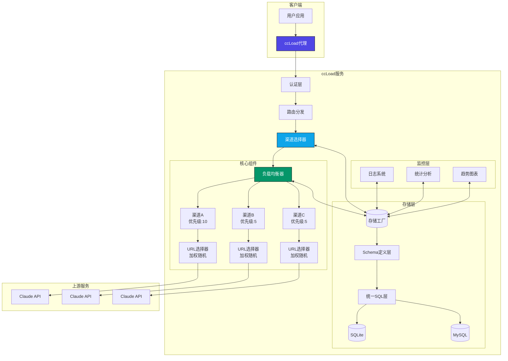

# ccLoad

**Claude Code、Codex、Gemini、OpenAI 多协议 AI API 网关。**

**[English](README.md) | 简体中文**

[](https://golang.org)
[](https://github.com/gin-gonic/gin)
[](https://hub.docker.com)
[](https://huggingface.co/spaces)
[](https://github.com/features/actions)
[](LICENSE)

> 智能路由 | 自动故障切换 | 指数冷却 | 多 URL 调度 | 协议转换 | 实时监控 | 成本控制

ccLoad 用一个 Go 服务接住多上游 AI API 的复杂度：Claude Code、Codex、Gemini、OpenAI 兼容客户端统一接入同一个网关，渠道选择、故障切换、冷却、协议转换、请求可观测性和费用限制都在服务端处理，不再散落到每个客户端脚本里。

## 🎯 解决什么问题

当你同时维护多个 AI API 渠道时，真正麻烦的是这些问题：

- **渠道切换靠手工**：不同 Key、有效期、额度和上游 URL 混在一起，迟早失控。
- **限流和故障打断工作流**：`429`、`502`、`504`、Key 过期、供应商过载，都不应该让客户端直接停摆。
- **请求状态不可见**：长时间流式请求没有实时状态，只能猜卡在客户端、网关还是上游。
- **HTTP 200 里藏错误**：部分上游返回成功状态码，但响应体实际是错误。
- **成本不可控**：共享网关需要渠道级和令牌级限额，不能等账单出来再补救。

ccLoad 直接处理这些问题：

- 🎯 **智能路由**：高优先级渠道优先使用，同级渠道按平滑加权轮询分流。
- 🔀 **自动故障切换**：按错误类型跳过故障 Key、渠道或 URL。
- ⏰ **指数冷却**：异常上游自动退避，避免重试持续打到坏渠道。
- 🌐 **多 URL 调度**：一个渠道可配置多个上游 URL，按延迟和健康度分配流量。
- 🔄 **协议转换**：Anthropic、OpenAI、Gemini、Codex 请求和响应可在网关层转换。
- 📊 **实时监控**：活跃请求、日志、Token、TTFB、费用和上游详情在后台直接可见。
- 🔍 **软错误检测**：HTTP 200 伪装成功也会触发故障切换。已覆盖：
  - `{"error": {...}}` 结构的 JSON 错误
  - `type` 字段是 `"error"` 的响应
  - SSE `error` 事件中的明确限流（`rate_limit_exceeded` / `too_many_requests`）按 `429` 处理
  - `"当前模型负载过高"` 之类的纯文本告警

## ✨ 主要特性

核心能力直接对应生产问题：

| 能力 | 亮点 | 效果 |
|------|------|------|
| 🚀 **性能怪兽** | Gin框架 + Sonic JSON | 1000+并发，高性能缓存 |
| 🧮 **本地算Token** | 不调API就能估算消耗 | 响应<5ms，准确度93%+ |
| 🎯 **错误分类器** | Key级/渠道级/客户端错误 | 200伪装错误也能揪出来 |
| 🔀 **智能调度** | 优先级+平滑加权轮询+健康度排序 | 异常渠道自动降权 |
| 🛡️ **故障秒切** | 指数退避冷却机制 | 2min→4min→8min→30min |
| 📊 **数据大屏** | 趋势图+日志+Token统计 | 一眼看清用量情况 |
| 🎯 **多API兼容** | Claude Code/Codex/Gemini/OpenAI | 一套配置走天下 |
| 📦 **开箱即用** | 单文件+嵌入式SQLite | 零依赖，下载就能跑 |
| 🐳 **云原生** | 多架构镜像+CI/CD | amd64/arm64都支持 |
| 🤗 **免费托管** | Hugging Face免费托管 | 适合个人试用 |
| 💰 **成本限额** | 渠道每日成本上限 | 达到限额自动跳过 |
| 🚦 **渠道RPM限制** | 每渠道滚动60秒请求上限 | 0=不限，超限自动跳过 |
| 🚧 **渠道并发限制** | 每渠道同时在飞请求上限 | 0=不限，超限自动跳过 |
| 🔐 **令牌限额** | API令牌费用上限+模型限制 | 精细化访问控制 |
| ⏱️ **首字节监控** | 流式请求TTFB记录 | 便于诊断上游延迟 |
| 🌐 **多URL负载均衡** | 单渠道多URL+加权随机 | 延迟低的URL自动多分流 |
| 💵 **service_tier定价** | OpenAI priority/flex/default层级 | 费用倍率精准计算 |
| 🖼️ **图像工具计费** | Responses image_generation/gpt-image-2 | 图像生成成本不漏算 |
| 📉 **分层定价** | GPT-5.4/Qwen-Plus/Gemini长上下文 | 超量token自动降档计费 |
| 🔄 **协议转换** | Anthropic/OpenAI/Gemini/Codex互转 | 保留采样与思考参数，一个渠道服务多种客户端协议 |
| 🔍 **调试日志** | 上游请求/响应原始数据捕获 | 敏感头脱敏，排障利器 |
| 🕐 **定时检测** | 渠道可用性后台定时探测 | 自动发现故障渠道 |
| 🧩 **自定义请求规则** | 渠道级请求头/JSON 请求体改写（remove/override/append） | 认证头保护 + CRLF 防护 + 容量上限 |
| 🎛️ **日志列自定义** | 表格列显隐可配置，设置持久化到浏览器 | 按需查看，减少信息噪音 |

## 🏗️ 架构概览

ccLoad 的请求链路很直接：

从你的应用发请求到API返回结果，中间经过这几层：
- **认证层** - 验证访问权限
- **路由分发** - 判断请求协议与路径，按 Claude Code、Codex、Gemini、OpenAI 分流处理
- **协议转换** - 客户端用OpenAI格式？上游是Anthropic？自动翻译，无感切换
- **智能调度** - 从多个渠道中选择当前最合适的上游
- **故障切换** - 选中的渠道失败后自动切换备用渠道

核心亮点：**存储层用工厂模式**，SQLite 和 MySQL 共享代码，消除了 467 行重复代码。数据层边界清晰，切换数据库只需要调整环境变量。



## 🚀 快速开始

选择适合当前环境的部署方式：

| 部署方式 | 难度 | 成本 | 适合谁 | HTTPS | 持久化 |
|---------|------|------|--------|-------|--------|
| 🐳 **Docker** | ⭐⭐ | 需VPS | 生产环境、追求稳定 | 需配置 | ✅ |
| 🤗 **Hugging Face** | ⭐ | **免费** | 个人试用、快速体验 | ✅自动 | ✅ |
| 🔧 **源码编译** | ⭐⭐⭐ | 需服务器 | 开发、定制构建 | 需配置 | ✅ |
| 📦 **二进制** | ⭐⭐ | 需服务器 | 轻量部署 | 需配置 | ✅ |

### 方式一：Docker 部署（推荐）

生产环境建议优先使用 Docker。官方镜像已发布到 GitHub Container Registry，可直接拉取运行。

**使用预构建镜像（推荐）**：
```bash
# 方式 1: 使用 docker-compose（最简单）
curl -o docker-compose.yml https://raw.githubusercontent.com/caidaoli/ccLoad/master/docker-compose.yml
curl -o .env https://raw.githubusercontent.com/caidaoli/ccLoad/master/.env.example
# 编辑 .env 文件设置密码
docker-compose up -d

# 方式 2: 直接运行镜像
docker pull ghcr.io/caidaoli/ccload:latest
docker run -d --name ccload \
  -p 8080:8080 \
  -e CCLOAD_PASS=your_secure_password \
  -v ccload_data:/app/data \
  ghcr.io/caidaoli/ccload:latest
```

**从源码构建**：

需要审计镜像内容或定制构建时，可从源码构建：
```bash
# 克隆项目
git clone https://github.com/caidaoli/ccLoad.git
cd ccLoad

# 使用 docker-compose 构建并运行
docker-compose -f docker-compose.build.yml up -d

# 或手动构建
docker build -t ccload:local .
docker run -d --name ccload \
  -p 8080:8080 \
  -e CCLOAD_PASS=your_secure_password \
  -v ccload_data:/app/data \
  ccload:local
```

### 方式二：源码编译

需要本地开发或修改代码时，使用源码编译：

```bash
# 克隆项目
git clone https://github.com/caidaoli/ccLoad.git
cd ccLoad

# 构建项目（默认使用高性能 JSON 库）
go build -tags sonic -o ccload .

# 或使用 Makefile
make build

# 直接运行开发模式
go run -tags sonic .
# 或
make dev
```

### 方式三：二进制下载

不需要 Docker 或 Go 环境时，可直接下载对应平台的二进制文件：

```bash
# 从 GitHub Releases 下载对应平台的二进制文件
wget https://github.com/caidaoli/ccLoad/releases/latest/download/ccload-linux-amd64
chmod +x ccload-linux-amd64
./ccload-linux-amd64
```

### 方式四：Hugging Face Spaces 部署

Hugging Face Spaces 提供免费的 Docker 托管和自动 HTTPS，适合个人试用与轻量场景。

#### 部署步骤

1. **登录 Hugging Face**

   访问 [huggingface.co](https://huggingface.co) 并登录你的账户

2. **创建新 Space**

   - 点击右上角 "New" → "Space"
   - **Space name**: `ccload`（或自定义名称）
   - **License**: `MIT`
   - **Select the SDK**: `Docker`
   - **Visibility**: `Public` 或 `Private`（私有需付费订阅）
   - 点击 "Create Space"

3. **创建 Dockerfile**

   在 Space 仓库中创建 `Dockerfile` 文件，内容如下：

   ```dockerfile
   FROM ghcr.io/caidaoli/ccload:latest
   ENV TZ=Asia/Shanghai
   ENV PORT=7860
   ENV SQLITE_PATH=/tmp/ccload.db
   EXPOSE 7860
   ```

   可以通过以下方式创建：

   **方式 A - Web 界面**（推荐）:
   - 在 Space 页面点击 "Files" 标签
   - 点击 "Add file" → "Create a new file"
   - 文件名输入 `Dockerfile`
   - 粘贴上述内容
   - 点击 "Commit new file to main"

   **方式 B - Git 命令行**:
   ```bash
   # 克隆你的 Space 仓库
   git clone https://huggingface.co/spaces/YOUR_USERNAME/ccload
   cd ccload

   # 创建 Dockerfile
   cat > Dockerfile << 'EOF'
   FROM ghcr.io/caidaoli/ccload:latest
   ENV TZ=Asia/Shanghai
   ENV PORT=7860
   ENV SQLITE_PATH=/tmp/ccload.db
   EXPOSE 7860
   EOF

   # 提交并推送
   git add Dockerfile
   git commit -m "Add Dockerfile for ccLoad deployment"
   git push
   ```

4. **配置环境变量（Secrets）**

   在 Space 设置页面（Settings → Variables and secrets → New secret）添加：

   | 变量名 | 值 | 必填 | 说明 |
   |--------|-----|------|------|
   | `CCLOAD_PASS` | `your_admin_password` | ✅ **必填** | 管理界面密码 |
   | `CCLOAD_API_TOKENS` | `token1\|生产,token2\|开发` | 可选 | 启动时预置 API 访问令牌 |

   **注意**:
   - API 访问令牌可通过 `CCLOAD_API_TOKENS` 预置，也可在 Web 管理界面 `/web/tokens.html` 配置
   - `PORT` 和 `SQLITE_PATH` 已在 Dockerfile 中设置，无需配置
   - Hugging Face Spaces 重启后 `/tmp` 目录会清空

5. **等待构建和启动**

   推送 Dockerfile 后，Hugging Face 会自动：
   - 拉取预构建镜像（约 30 秒）
   - 启动应用容器（约 10 秒）
   - 总耗时约 1-2 分钟（比从源码构建快 3-5 倍）

6. **访问应用**

   构建完成后，通过以下地址访问：
   - **应用地址**: `https://YOUR_USERNAME-ccload.hf.space`
   - **管理界面**: `https://YOUR_USERNAME-ccload.hf.space/web/`
   - **API 端点**: `https://YOUR_USERNAME-ccload.hf.space/v1/messages`

   **首次访问提示**:
   - 如果 Space 处于休眠状态，首次访问需等待 20-30 秒唤醒
   - 后续访问会立即响应

#### Hugging Face 部署特点

**优势**:
- ✅ **完全免费**: 公开 Space 永久免费，包含 CPU 和存储
- ✅ **极速部署**: 使用预构建镜像，1-2 分钟即可完成（比源码构建快 3-5 倍）
- ✅ **自动 HTTPS**: 无需配置 SSL 证书，自动提供安全连接
- ✅ **自动重启**: 应用崩溃后自动重启
- ✅ **版本控制**: 基于 Git，方便回滚和协作
- ✅ **简单维护**: 仅需 5 行 Dockerfile，无需管理源码

**限制**:
- ⚠️ **资源限制**: 免费版提供 2 CPU + 16GB RAM
- ⚠️ **休眠策略**: 48 小时无访问会进入休眠，首次访问需等待唤醒（约 20-30 秒）
- ⚠️ **固定端口**: 必须使用 7860 端口
- ⚠️ **公网访问**: Space 默认公开，必须通过 Web 管理界面配置 API 访问令牌才能访问 /v1/* API（否则 401）

#### 数据持久化

**重要**: Hugging Face Spaces 的存储策略

由于 Hugging Face Spaces 的限制（`/tmp` 目录重启后清空），**强烈推荐使用外部 MySQL 数据库**实现完整的数据持久化：

**方案一：混合存储模式（推荐，性能最优）**
- ✅ **极速查询**: 所有读写走本地 SQLite，延迟 <1ms（免费 MySQL 延迟 800ms+）
- ✅ **重启不丢数据**: 异步同步到 MySQL，启动时自动恢复
- ✅ **统计缓存**: 智能 TTL 缓存，减少重复聚合查询
- 配置方法: 在 Secrets 中添加 `CCLOAD_MYSQL` + `CCLOAD_ENABLE_SQLITE_REPLICA=1`

**Dockerfile 示例（混合模式）**:
```dockerfile
FROM ghcr.io/caidaoli/ccload:latest
ENV TZ=Asia/Shanghai
ENV PORT=7860
# Secrets 中配置: CCLOAD_MYSQL + CCLOAD_ENABLE_SQLITE_REPLICA=1
EXPOSE 7860
```

**方案二：纯 MySQL 模式**
- ✅ **完整持久化**: 渠道配置、日志记录、统计数据全部保留
- ✅ **重启不丢数据**: 数据存储在外部数据库，不受 Space 重启影响
- ⚠️ **查询较慢**: 免费 MySQL 延迟较高，统计页面响应慢
- 配置方法: 在 Secrets 中添加 `CCLOAD_MYSQL` 环境变量

**推荐的免费 MySQL 服务**:
- [TiDB Cloud Serverless](https://tidbcloud.com/) - 免费 5GB 存储，MySQL 兼容，无连接数限制，推荐首选
- [Aiven for MySQL](https://aiven.io/) - 免费 1GB 存储，支持多区域部署

**MySQL 配置示例（以 TiDB Cloud 为例）**:
1. 注册 [TiDB Cloud](https://tidbcloud.com/) 账户
2. 创建 Serverless Cluster（免费）
3. 获取连接信息，格式为：`user:password@tcp(host:4000)/database?tls=true`
4. 在 Hugging Face Space 的 Secrets 中添加 `CCLOAD_MYSQL` 变量
5. **（可选）启用混合模式**: 添加 `CCLOAD_ENABLE_SQLITE_REPLICA=1` 获得最佳性能
6. 重启 Space，所有数据将自动持久化到 MySQL

**Dockerfile 示例（纯 MySQL）**:
```dockerfile
FROM ghcr.io/caidaoli/ccload:latest
ENV TZ=Asia/Shanghai
ENV PORT=7860
# 不需要 SQLITE_PATH，使用 CCLOAD_MYSQL 环境变量
EXPOSE 7860
```

**方案三：仅本地存储（不推荐）**
- ⚠️ **数据丢失**: Space 重启后 `/tmp` 目录会清空，渠道配置会丢失
- ⚠️ **手动恢复**: 需要重新通过 Web 界面或 CSV 导入配置渠道
- 使用场景: 仅用于临时测试

#### 更新部署

由于使用预构建镜像，更新非常简单：

**自动更新**:
- 当官方发布新版本镜像（`ghcr.io/caidaoli/ccload:latest`）时
- 在 Space 设置中点击 "Factory rebuild" 即可自动拉取最新镜像
- 或等待 Hugging Face 自动重启（通常 48 小时后）

**手动触发更新**:
```bash
# 在 Space 仓库中添加一个空提交来触发重建
git commit --allow-empty -m "Trigger rebuild to pull latest image"
git push
```

**版本锁定**（可选）:
如果需要锁定特定版本，修改 Dockerfile：
```dockerfile
FROM ghcr.io/caidaoli/ccload:2.19.0  # 指定版本号
ENV TZ=Asia/Shanghai
ENV PORT=7860
ENV SQLITE_PATH=/tmp/ccload.db
EXPOSE 7860
```

### 基本配置

部署完成后，按场景选择 SQLite 或 MySQL：

**SQLite 模式（默认）**：
个人或小团队可优先使用 SQLite，零外部依赖，单文件持久化：
```bash
# 设置环境变量
export CCLOAD_PASS=your_admin_password
export PORT=8080
export SQLITE_PATH=./data/ccload.db

# 或使用 .env 文件
echo "CCLOAD_PASS=your_admin_password" > .env
echo "PORT=8080" >> .env
echo "SQLITE_PATH=./data/ccload.db" >> .env

# 启动服务
./ccload
```

**MySQL 模式**：
生产环境、高并发或多实例部署建议使用 MySQL：
```bash
# 1. 创建 MySQL 数据库
mysql -u root -p -e "CREATE DATABASE ccload CHARACTER SET utf8mb4 COLLATE utf8mb4_unicode_ci;"

# 2. 设置环境变量
export CCLOAD_PASS=your_admin_password
export CCLOAD_MYSQL="user:password@tcp(localhost:3306)/ccload?charset=utf8mb4"
export PORT=8080

# 或使用 .env 文件
echo "CCLOAD_PASS=your_admin_password" > .env
echo "CCLOAD_MYSQL=user:password@tcp(localhost:3306)/ccload?charset=utf8mb4" >> .env
echo "PORT=8080" >> .env

# 3. 启动服务（自动创建表结构）
./ccload
```

**Docker + MySQL**:
```bash
# 方式 1: docker-compose（推荐）
cat > docker-compose.mysql.yml << 'EOF'
version: '3.8'
services:
  mysql:
    image: mysql:8.0
    environment:
      MYSQL_ROOT_PASSWORD: rootpass
      MYSQL_DATABASE: ccload
      MYSQL_USER: ccload
      MYSQL_PASSWORD: ccloadpass
    volumes:
      - mysql_data:/var/lib/mysql
    ports:
      - "3306:3306"
    healthcheck:
      test: ["CMD", "mysqladmin", "ping", "-h", "localhost"]
      interval: 10s
      timeout: 5s
      retries: 5

  ccload:
    image: ghcr.io/caidaoli/ccload:latest
    environment:
      CCLOAD_PASS: your_admin_password
      CCLOAD_MYSQL: "ccload:ccloadpass@tcp(mysql:3306)/ccload?charset=utf8mb4"
      PORT: 8080
    ports:
      - "8080:8080"
    depends_on:
      mysql:
        condition: service_healthy

volumes:
  mysql_data:
EOF

docker-compose -f docker-compose.mysql.yml up -d

# 方式 2: 直接运行（需要已有 MySQL 服务）
docker run -d --name ccload \
  -p 8080:8080 \
  -e CCLOAD_PASS=your_admin_password \
  -e CCLOAD_MYSQL="user:pass@tcp(mysql_host:3306)/ccload?charset=utf8mb4" \
  ghcr.io/caidaoli/ccload:latest
```

服务启动后访问：
- 管理界面：`http://localhost:8080/web/`
- API 代理：`POST http://localhost:8080/v1/messages`
- **API 令牌管理**：`http://localhost:8080/web/tokens.html` - 通过 Web 界面配置 API 访问令牌

## 📖 使用说明

配置完成后即可通过兼容 API 调用：

### API 代理

**Claude API 代理（需授权）**：

先在 Web 界面配置 API 令牌，然后按 Claude API 兼容接口调用：

```bash
curl -X POST http://localhost:8080/v1/messages \
  -H "Content-Type: application/json" \
  -H "Authorization: Bearer your-api-token" \
  -H "x-api-key: your-claude-api-key" \
  -H "anthropic-version: 2023-06-01" \
  -d '{
    "model": "claude-sonnet-4-6",
    "max_tokens": 1024,
    "messages": [
      {
        "role": "user",
        "content": "Hello, Claude!"
      }
    ]
  }'
```

**OpenAI 兼容 API 代理（Chat Completions）**：

OpenAI SDK 只需替换 `base_url` 即可接入，业务代码无需改动：

```bash
curl -X POST http://localhost:8080/v1/chat/completions \
  -H "Content-Type: application/json" \
  -H "Authorization: Bearer your-api-token" \
  -d '{
    "model": "gpt-4o",
    "messages": [
      {
        "role": "user",
        "content": "Hello!"
      }
    ]
  }'
```

### 本地 Token 计数

发送请求前可用本地 Token 估算接口预估消耗，不调用上游 API：

```bash
curl -X POST http://localhost:8080/v1/messages/count_tokens \
  -H "Content-Type: application/json" \
  -d '{
    "model": "claude-sonnet-4-6",
    "messages": [
      {"role": "user", "content": "Hello, how are you?"}
    ],
    "system": "You are a helpful assistant."
  }'

# 响应示例
# {
#   "input_tokens": 28
# }
```

**特点**：
- ✅ 符合 Anthropic 官方 API 规范
- ✅ 本地计算，响应 <5ms，不消耗 API 配额
- ✅ 准确度 93%+（与官方 API 对比）
- ✅ 支持系统提示词、工具定义、大规模工具场景
- ✅ 需授权令牌访问（在 Web 管理界面 `/web/tokens.html` 配置令牌）

### 渠道管理

渠道可通过 Web 界面或 Admin API 管理：

通过 Web 界面 `/web/channels.html` 或 API 管理渠道：

```bash
# 添加渠道（支持多URL，逗号分隔）
curl -X POST http://localhost:8080/admin/channels \
  -H "Content-Type: application/json" \
  -d '{
    "name": "Claude-API",
    "api_key": "sk-ant-api03-xxx",
    "url": "https://api.anthropic.com,https://api2.anthropic.com",
    "priority": 10,
    "rpm_limit": 0,
    "max_concurrency": 0,
    "models": ["claude-sonnet-4-6", "claude-opus-4-6"],
    "enabled": true
  }'
```

> **多URL说明**：`url` 字段支持逗号分隔的多个URL。系统会按延迟加权随机选择最优URL，故障URL自动冷却，实现同渠道内的URL级负载均衡与故障切换。

> **RPM限制说明**：`rpm_limit` 是渠道级请求数上限，按滚动 60 秒窗口统计；`0` 表示不限制。代理转发、手动测试、单 URL 测试和定时检测都会计入，达到上限后该渠道会被跳过；多 URL 故障重试按实际发出的上游 HTTP 请求计数。计数保存在当前进程内，服务重启会清空，多实例部署时各实例独立统计。

> **并发限制说明**：`max_concurrency` 是渠道级同时在飞请求上限；`0` 表示不限制。槽位从发起上游请求前占用，到响应体关闭后释放，流式请求会占用到流结束；达到上限后该渠道会被跳过，不触发冷却。计数保存在当前进程内，多实例部署时各实例独立统计。

### 自定义请求规则（高级）

渠道编辑弹窗底部「高级」按钮可打开二级模态，按渠道粒度改写转发给上游的 **HTTP 请求头** 与 **JSON 请求体**，常用于 `User-Agent` 覆写、强制版本头、微调 `thinking` / `max_tokens` 等字段。规则按配置顺序生效，保存后对该渠道后续所有请求立即生效。

**动作矩阵**:

| 对象 | `remove` | `override` | `append` |
|---|---|---|---|
| HTTP Header | 删除指定 header（支持对多值头按 token 精确剔除，如 `Anthropic-Beta`） | `Header.Set` 替换所有值 | `Header.Add` 追加一个值（多值头语义） |
| JSON Body | 按点分路径删除 key / 数组元素 | 按路径设置值，不存在则创建中间节点 | 不支持（JSON 语义模糊） |

**JSON 路径语法**:
- 点分路径 + 数字数组下标：`thinking.budget_tokens`、`messages.0.role`、`generation_config.temperature`
- 值支持任意 JSON 字面量：数字 `0.7`、布尔 `true`、字符串 `"claude-opus-4-6"`、对象 `{"type":"adaptive"}`、数组 `["a","b"]`

**安全约束**（硬保护，前端校验被绕过也由后端兜底）:
- **认证头黑名单**：`Authorization`、`x-api-key`、`x-goog-api-key`（大小写不敏感）任何规则一律忽略并写 `slog.Warn`
- **CRLF 注入防御**：header 名称/值禁止包含 `\r\n`
- **非 JSON body 静默跳过**：`Content-Type` 不含 `application/json`、body 为空、或反序列化失败时原样透传，不阻断请求
- **容量上限**：单渠道 header 规则 ≤ 32 条、body 规则 ≤ 32 条、单条 value ≤ 8 KB；违反返回 400

**典型示例**:
```jsonc
{
  "custom_request_rules": {
    "headers": [
      { "action": "override", "name": "User-Agent", "value": "claude-cli/1.0 (custom)" },
      { "action": "remove",   "name": "Anthropic-Beta", "value": "context-1m-2025-08-07" },
      { "action": "append",   "name": "Accept", "value": "application/json" }
    ],
    "body": [
      { "action": "override", "path": "thinking", "value": {"type":"adaptive"} },
      { "action": "override", "path": "max_tokens", "value": 4096 },
      { "action": "remove",   "path": "stop_sequences" }
    ]
  }
}
```

> **与内置逻辑的关系**：自定义规则在 anyrouter 的 `anthropic-beta` 注入**之后**生效，可覆盖或移除 beta flag；anyrouter 的 adaptive thinking 注入会检测到用户已显式设置 `thinking` 而不再覆盖。认证头无论何时都不可改写。

### 批量数据管理

渠道数量较多时，可用 CSV 导入导出批量维护配置：

**导出配置**:
```bash
# Web界面: 访问 /web/channels.html，点击"导出CSV"按钮
# API调用:
curl -H "Authorization: Bearer your_token" \
  http://localhost:8080/admin/channels/export > channels.csv
```

**导入配置**:
```bash
# Web界面: 访问 /web/channels.html，点击"导入CSV"按钮
# API调用:
curl -X POST -H "Authorization: Bearer your_token" \
  -F "file=@channels.csv" \
  http://localhost:8080/admin/channels/import
```

**CSV格式示例**:
```csv
name,api_key,url,priority,models,enabled
Claude-API-1,sk-ant-xxx,https://api.anthropic.com,10,"[\"claude-sonnet-4-6\"]",true
Claude-API-2,sk-ant-yyy,https://api.anthropic.com,5,"[\"claude-opus-4-6\"]",true
```

**特性**:
- 支持中英文列名自动映射
- 智能数据验证和错误提示
- 增量导入和覆盖更新
- UTF-8编码，Excel兼容

## 📊 监控指标

管理后台提供请求、日志、Token 和渠道状态的实时视图：


*实时监控大屏：Claude Code、Codex、OpenAI、Gemini四大平台数据一目了然*

**核心功能**：
- 📈 **24小时趋势图** - 请求量一目了然，高峰低谷清清楚楚
- 🔴 **实时错误日志** - 渠道异常可秒级发现
- 📊 **渠道调用统计** - 用数据判断渠道负载和可用性
- ⚡ **性能指标** - 延迟、成功率，性能瓶颈无处藏
- 💰 **Token用量统计** - 钱花哪了心里有数：
  - 自定义时间范围，想看哪段看哪段
  - 按API令牌分类，多租户也能分账
  - 支持Gemini/OpenAI缓存Token展示

- 🎛️ **日志列显隐自定义** - 点击齿轮图标按需显示/隐藏列，设置自动保存到浏览器

**界面亮点**：
- 🎨 渐变紫色主题，看着舒服
- 📱 响应式设计，手机电脑都好用
- ⚡ 数据实时刷新，不用手动F5
- 📊 多维度统计卡片，关键数据一屏看完

## 🔧 技术栈

ccLoad 使用的核心技术栈：

### 核心依赖

| 组件 | 版本 | 用途 | 性能优势 |
|------|------|------|----------|
| **Go** | 1.25.0+ | 运行时环境 | 原生并发支持，内置 min 函数 |
| **Gin** | v1.12.0 | Web框架 | 高性能HTTP路由 |
| **modernc/sqlite** | v1.51.0 | 嵌入式数据库 | 纯Go实现，零CGO依赖，单文件存储（默认） |
| **MySQL** | v1.10.0 | 关系型数据库 | 可选，适合高并发生产环境 |
| **Sonic** | v1.15.1 | JSON库 | 比标准库快2-3倍 |
| **godotenv** | v1.5.1 | 环境配置 | 简化配置管理 |

### 架构特点

架构重点：

**模块化架构**（SOLID原则实践）:
- **proxy模块拆分**（SRP原则）：
  - `proxy_handler.go`：HTTP入口、并发控制、路由选择
  - `proxy_forward.go`：核心转发逻辑、请求构建、响应处理
  - `proxy_error.go`：错误处理、冷却决策、重试逻辑
  - `proxy_util.go`：常量、类型定义、工具函数
  - `proxy_stream.go`：流式响应、首字节检测
  - `proxy_gemini.go`：Gemini API特殊处理
  - `proxy_sse_parser.go`：SSE解析器（防御性处理，支持 Gemini/OpenAI 缓存 Token 解析）
  - `proxy_debug.go`：上游请求/响应调试捕获（含敏感头脱敏）
- **admin模块拆分**（SRP原则）：
  - `admin_channels.go`：渠道CRUD操作
  - `admin_stats.go`：统计分析API
  - `admin_cooldown.go`：冷却管理API
  - `admin_csv.go`：CSV导入导出
  - `admin_types.go`：管理API类型定义
  - `admin_auth_tokens.go`：API访问令牌CRUD（支持Token统计、费用限额、模型限制）
  - `admin_settings.go`：系统设置管理
  - `admin_models.go`：模型列表管理
  - `admin_testing.go`：渠道测试功能（支持协议转换测试）
  - `admin_debug_log.go`：调试日志API（敏感头脱敏+base64二进制编码）
  - `channel_check_scheduler.go`：渠道定时检测调度器
  - `detection_log.go`：检测日志构建（定时检测结果→LogEntry）
- **协议转换系统**（2026-04新增）：
  - `protocol/types.go`：四大协议定义（Anthropic/OpenAI/Gemini/Codex）
  - `protocol/registry.go`：请求/响应转换器注册表
  - `protocol/builtin/`：18个内置转换实现（支持流式与非流式）
  - 保留采样/上限/停止词/seed 参数；Gemini `thinkingConfig.thinkingLevel` 会映射为目标协议的 reasoning/thinking 配置
  - 两种模式：`upstream`（默认，由上游原生处理）/ `local`（本地翻译）
  - 渠道配置：`ProtocolTransformMode` + `ProtocolTransforms`
- **冷却管理器**（DRY原则）：
  - `cooldown/manager.go`：统一冷却决策引擎
  - 消除重复代码，冷却逻辑统一管理
  - 区分网络错误和HTTP错误的分类策略
  - 识别结构化配额/模型冷却响应，按上游返回的重置时间精确冷却
  - 内置单Key渠道自动升级逻辑
- **多URL选择器**（URLSelector）：
  - `url_selector.go`：单渠道多URL智能调度
  - 探索优先：未访问过的URL优先尝试，确保收集延迟数据
  - 加权随机：权重=1/EWMA延迟，延迟低的URL自动多分流
  - 独立冷却：故障URL指数退避，不影响同渠道其他URL
  - BaseURL追踪：活跃请求、日志和UI全链路携带上游URL
- **存储层重构**（2025-12优化，消除467行重复代码）：
  - `storage/schema/`：统一Schema定义（支持SQLite/MySQL差异）
  - `storage/sql/`：通用SQL实现层（SQLite/MySQL共享）
  - `storage/factory.go`：工厂模式自动选择数据库
  - 复合索引优化，统计查询性能提升
- **OpenAI service_tier 定价**（2026-03新增）：
  - `util.OpenAIServiceTierMultiplier()`：返回 priority/flex/default 层级对应倍率
  - `LogEntry.ServiceTier`：持久化到数据库，日志成本列显示层级标注
  - 支持 GPT-5.4、GPT-5.4-pro 等最新模型定价
- **Responses image_generation 工具计费**（2026-05新增）：
  - 解析 Responses API 的 `tool_usage.image_gen` 与 `image_generation` 工具模型
  - `gpt-image-2` 按文本输入、图像输入、图像输出 token 分项计费
  - 流式/非流式代理链路与渠道测试共用同一 usage 解析器，避免费用口径漂移
- **分层定价（Tiered Pricing）**：
  - GPT-5.4：超过阈值 token 后输入价格自动降档
  - Qwen-Plus：超过阈值后触发低价区间
  - Gemini 长上下文：超过阈值后价格翻倍
  - 缓存折扣：Claude/Opus 独立乘数，OpenAI 缓存命中50%折扣

**多级缓存系统**:
- 渠道配置缓存（60秒TTL）- 减少数据库查询
- 轮询指针缓存（内存）- 毫秒级选择
- 冷却状态内联（直接存表）- 无需JOIN，速度飞起
- 错误分类缓存（1000容量）- 重复错误秒判

**异步处理架构**:
- 日志系统（1000条缓冲 + 单worker，保证FIFO顺序）
- Token/日志清理（后台协程，定期维护）

**统一响应系统**（代码复用典范）:
- `StandardResponse[T]` 泛型结构体（DRY原则）- 一个结构搞定所有响应
- `ResponseHelper` 辅助类及9个快捷方法 - 少写重复代码
- 自动提取应用级错误码，统一JSON格式 - 前端调用更方便

**连接池优化**:
- SQLite: 内存模式10个连接/文件模式5个连接，5分钟生命周期
- HTTP客户端: 100最大连接，30秒超时，keepalive优化
- TLS: 会话缓存（1024容量），减少握手耗时

## 🔧 配置说明

可通过以下配置项调整运行行为：

### 环境变量

| 变量名 | 默认值 | 说明 |
|--------|--------|------|
| `CCLOAD_PASS` | 无 | 管理界面密码（**必填**，未设置将退出） |
| `CCLOAD_API_TOKENS` | 无 | 启动时预置 API 访问令牌，格式：`token1,token2` 或 `token1\|生产,token2\|开发`；已存在的 token 不会被覆盖 |
| `API_TOKENS` | 无 | `CCLOAD_API_TOKENS` 的兼容别名；两个变量同时设置且值不一致时启动失败 |
| `CCLOAD_MYSQL` | 无 | MySQL DSN（可选，格式: `user:pass@tcp(host:port)/db?charset=utf8mb4`）<br/>**设置后使用 MySQL，否则使用 SQLite** |
| `CCLOAD_ENABLE_SQLITE_REPLICA` | `0` | 混合存储模式开关（`1`=启用，见下方说明） |
| `CCLOAD_SQLITE_LOG_DAYS` | `7` | 混合模式启动时从 MySQL 恢复日志的天数（-1=全量，0=不恢复日志） |
| `CCLOAD_ALLOW_INSECURE_TLS` | `0` | 禁用上游 TLS 证书校验（`1`=启用；⚠️仅用于临时排障/受控内网环境） |
| `PORT` | `8080` | 服务端口 |
| `GIN_MODE` | `release` | 运行模式（`debug`/`release`） |
| `GIN_LOG` | `true` | Gin 访问日志开关（`false`/`0`/`no`/`off` 关闭） |
| `TRUSTED_PROXIES` | 私有网段 + Loopback + `100.64.0.0/10` | 可信代理 CIDR 列表（逗号分隔）；`none`=不信任任何代理 |
| `SQLITE_PATH` | `data/ccload.db` | SQLite 数据库文件路径（仅 SQLite 模式） |
| `SQLITE_JOURNAL_MODE` | `WAL` | SQLite Journal 模式（WAL/TRUNCATE/DELETE 等，容器环境建议 TRUNCATE） |
| `CCLOAD_MAX_CONCURRENCY` | `1000` | 最大并发请求数（限制同时处理的代理请求数量） |
| `CCLOAD_MAX_BODY_BYTES` | `10485760` | 请求体最大字节数（10MB，Images API自动放宽至20MB） |
| `CCLOAD_COOLDOWN_AUTH_SEC` | `300` | 认证错误(401/402/403)初始冷却时间（秒） |
| `CCLOAD_COOLDOWN_SERVER_SEC` | `120` | 服务器错误(5xx)初始冷却时间（秒） |
| `CCLOAD_COOLDOWN_TIMEOUT_SEC` | `60` | 超时错误(597/598)初始冷却时间（秒） |
| `CCLOAD_COOLDOWN_RATE_LIMIT_SEC` | `60` | 限流错误(429)初始冷却时间（秒） |
| `CCLOAD_COOLDOWN_MAX_SEC` | `1800` | 指数退避冷却上限（秒，30分钟） |
| `CCLOAD_COOLDOWN_MIN_SEC` | `10` | 指数退避冷却下限（秒） |

> 如果你的服务挂在反向代理或负载均衡后面，建议显式设置 `TRUSTED_PROXIES`，避免伪造 `X-Forwarded-For` 干扰客户端 IP 识别和登录限速。

#### 混合存储模式（MySQL 主 + SQLite 缓存）

HuggingFace Spaces 等环境重启后本地数据会丢失，但免费 MySQL 查询延迟较高（800ms+）。混合模式两全其美：

- **MySQL 主存储**：写操作先写 MySQL，确保数据持久化
- **SQLite 本地缓存**：读操作走本地 SQLite，延迟 <1ms
- **启动恢复**：从 MySQL 恢复数据到 SQLite，支持按天数恢复日志
- **日志特殊处理**：先写 SQLite（快），再异步同步到 MySQL（备份）

```bash
# 启用混合模式
export CCLOAD_MYSQL="user:pass@tcp(host:3306)/db?charset=utf8mb4"
export CCLOAD_ENABLE_SQLITE_REPLICA=1
export CCLOAD_SQLITE_LOG_DAYS=7  # 恢复最近 7 天日志（可选）
```

**三种存储模式**：
| 模式 | 配置 | 适用场景 |
|------|------|---------|
| 纯 SQLite | 不设置 `CCLOAD_MYSQL` | 本地开发、单机部署 |
| 纯 MySQL | 设置 `CCLOAD_MYSQL` | 标准生产环境 |
| 混合模式 | 设置 `CCLOAD_MYSQL` + `CCLOAD_ENABLE_SQLITE_REPLICA=1` | HuggingFace Spaces |

### Web 管理配置（支持热重载）

这些配置可在 Web 界面修改，保存后立即生效，无需重启：

| 配置项 | 默认值 | 说明 |
|--------|--------|------|
| `log_retention_days` | `7` | 日志保留天数（-1永久保留，1-365天） |
| `max_key_retries` | `3` | 单个渠道内最大Key重试次数 |
| `upstream_first_byte_timeout` | `0` | 上游首个有效流内容超时（秒，0=禁用，仅流式） |
| `non_stream_timeout` | `120` | 非流式请求超时（秒，0=禁用） |
| `anthropic_first_byte_timeout` | `0` | Anthropic 上游首个有效流内容超时（秒，0=使用全局 `upstream_first_byte_timeout`） |
| `anthropic_non_stream_timeout` | `0` | Anthropic 非流式请求超时（秒，0=使用全局 `non_stream_timeout`） |
| `codex_first_byte_timeout` | `0` | Codex 上游首个有效流内容超时（秒，0=使用全局 `upstream_first_byte_timeout`） |
| `codex_non_stream_timeout` | `0` | Codex 非流式请求超时（秒，0=使用全局 `non_stream_timeout`） |
| `openai_first_byte_timeout` | `0` | OpenAI 上游首个有效流内容超时（秒，0=使用全局 `upstream_first_byte_timeout`） |
| `openai_non_stream_timeout` | `0` | OpenAI 非流式请求超时（秒，0=使用全局 `non_stream_timeout`） |
| `gemini_first_byte_timeout` | `0` | Gemini 上游首个有效流内容超时（秒，0=使用全局 `upstream_first_byte_timeout`） |
| `gemini_non_stream_timeout` | `0` | Gemini 非流式请求超时（秒，0=使用全局 `non_stream_timeout`） |
| `enable_health_score` | `false` | 启用基于健康度的渠道动态排序 |
| `success_rate_penalty_weight` | `100` | 成功率惩罚权重（见下方说明） |
| `health_score_window_minutes` | `30` | 成功率统计时间窗口（分钟） |
| `health_score_update_interval` | `30` | 成功率缓存更新间隔（秒） |
| `health_min_confident_sample` | `20` | 置信样本量阈值（样本量达到此值时惩罚全额生效） |
| `channel_check_interval_hours` | `0` | 渠道定时检测间隔（小时，0=禁用） |

分协议超时按“实际转发到的上游协议”生效：协议转换后转发到 OpenAI，就读取 `openai_*_timeout`；对应值为 `0` 时回退全局超时。

#### 健康度排序说明

启用健康度排序后，低成功率渠道会自动降低有效优先级：

启用 `enable_health_score` 后，系统会根据渠道的历史成功率动态调整优先级，成功率低的渠道优先级自动降低：

```
置信度 = min(1.0, 样本量 / health_min_confident_sample)
有效优先级 = 基础优先级 - (失败率 × success_rate_penalty_weight × 置信度)
```

**置信度因子**：解决新渠道或低流量渠道因样本量小导致的过度惩罚问题。样本量越小，置信度越低，惩罚打折越多。

**示例**（`success_rate_penalty_weight = 100`，`health_min_confident_sample = 20`）：

| 渠道 | 基础优先级 | 成功率 | 样本量 | 置信度 | 惩罚值 | 有效优先级 |
|------|-----------|--------|--------|--------|--------|-----------|
| A | 100 | 95% | 100 | 1.0 | 5 | **95** |
| B | 90 | 70% | 80 | 1.0 | 30 | **60** |
| C | 80 | 60% | 4 | 0.2 | 8 | **72** |
| D | 70 | 100% | 50 | 1.0 | 0 | **70** |

基础优先级排序：A > B > C > D
**有效优先级排序：A (95) > C (72) > D (70) > B (60)**

**动态排序效果**：
- 渠道 B 原本排第二，但 70% 成功率导致惩罚 30，降至最后
- 渠道 D 原本排最后，但 100% 成功率使其超越 B 和 C
- 渠道 C 成功率仅 60%，但样本量 4（置信度 0.2）使惩罚从 40 降为 8，避免新渠道被过早淘汰

**权重调优建议**：
- 默认值 100 适合渠道优先级间隔为 10 的场景
- 权重 100 时：10% 失败率 = 降一档优先级（满置信度时）
- 若优先级间隔为 5，可调整为 50
- `health_min_confident_sample` 建议根据日均请求量调整，默认 20 适合中等流量场景

#### API 访问令牌配置

**重点**：API 令牌默认在 Web 界面管理；Docker/CI 迁移场景可用环境变量预置：

- 访问 `http://localhost:8080/web/tokens.html` 进行令牌管理
- 启动时可设置 `CCLOAD_API_TOKENS=token1|生产,token2|开发` 自动创建缺失令牌
- 预置逻辑是幂等的：已存在的 token 保留原描述、限额、模型/渠道限制和统计数据
- 支持添加、删除、查看令牌
- 所有令牌存储在数据库中，支持持久化
- 未配置任何令牌时，所有 `/v1/*` 与 `/v1beta/*` API 返回 `401 Unauthorized`

⚠️ **安全提示**：
- 生产环境优先使用 Docker Secrets、Kubernetes Secrets 或平台加密 Secrets，避免把 token 明文写进普通环境变量
- CI/CD 中不要打印完整环境变量，避免日志泄露
- 预置完成后如不再需要自动恢复，可从部署配置中移除 `CCLOAD_API_TOKENS`
- 限制容器 inspect、编排平台控制台和部署配置的访问权限

**令牌高级功能**（2026-01新增）：
- **费用限额**：为每个令牌设置费用上限（美元），超限后拒绝请求返回 429
- **模型限制**：限制令牌可访问的模型列表，增强访问控制
- **首字节时间**：记录流式请求的 TTFB（毫秒），便于诊断上游延迟

#### 行为摘要

行为摘要：

- 未设置 `CCLOAD_PASS`：程序启动失败并退出（安全第一）
- 未配置 API 访问令牌：所有 `/v1/*` 与 `/v1beta/*` API 返回 `401 Unauthorized`，去Web界面 `/web/tokens.html` 配置令牌
- 公开端点：仅 `GET /health`（健康检查）无需认证；`GET /public/summary`（统计摘要）现在需要管理员登录，其它后台页面/API 也都需要授权

### Docker 镜像

官方镜像支持多架构：

- **支持架构**：`linux/amd64`, `linux/arm64`
- **镜像仓库**：`ghcr.io/caidaoli/ccload`
- **可用标签**：
  - `latest` - 最新稳定版本
  - `2.19.0` - 具体版本号
  - `2.19` - 主要.次要版本
  - `2` - 主要版本

### 镜像标签说明

```bash
# 拉取最新版本
docker pull ghcr.io/caidaoli/ccload:latest

# 拉取指定版本
docker pull ghcr.io/caidaoli/ccload:2.19.0

# 指定架构（Docker 通常自动选择）
docker pull --platform linux/amd64 ghcr.io/caidaoli/ccload:latest
docker pull --platform linux/arm64 ghcr.io/caidaoli/ccload:latest
```

### 数据库结构

数据库结构如下：

**存储架构（工厂模式）**:
```
storage/
├── store.go         # Store 接口（统一契约）
├── factory.go       # NewStore() 自动选择数据库
├── schema/          # 统一 Schema 定义层（2025-12 新增）
│   ├── tables.go    # 表结构定义（DefineXxxTable 函数）
│   └── builder.go   # Schema 构建器（支持 SQLite/MySQL 差异）
├── sql/             # 通用 SQL 实现层（2025-12 重构，消除 467 行重复代码）
│   ├── store_impl.go      # SQLStore 核心实现
│   ├── config.go          # 渠道配置 CRUD
│   ├── apikey.go          # API 密钥 CRUD
│   ├── cooldown.go        # 冷却管理
│   ├── log.go             # 日志存储
│   ├── metrics.go             # 指标统计
│   ├── metrics_filter.go      # 过滤条件交集支持
│   ├── metrics_aggregate_rows.go  # 聚合行处理
│   ├── metrics_finalize.go    # 终结化处理
│   ├── auth_tokens.go         # API 访问令牌
│   ├── auth_token_stats.go    # 令牌统计
│   ├── admin_sessions.go  # 管理会话
│   ├── system_settings.go # 系统设置
│   └── helpers.go         # 辅助函数
└── sqlite/          # SQLite 特定（仅测试文件）
```

**数据库选择逻辑**:
- 设置 `CCLOAD_MYSQL` 环境变量 → 使用 MySQL
- 未设置 → 使用 SQLite（默认）

**核心表结构**（SQLite 和 MySQL 共用）:
- `channels` - 渠道配置（冷却数据内联，UNIQUE 约束 name，含协议转换配置、定时检测配置、RPM/并发限制配置）
- `api_keys` - API 密钥（Key 级冷却内联，支持多 Key 策略）
- `logs` - 请求日志（含base_url上游URL追踪）
- `debug_logs` - 调试日志（上游请求/响应原始数据，独立清理策略）
- `key_rr` - 轮询指针（channel_id → idx）
- `auth_tokens` - 认证令牌（支持费用限额、模型限制、首字节时间记录）
- `admin_sessions` - 管理会话
- `system_settings` - 系统配置（支持热重载）

**架构特性** (✅ 2025-12月 ~ 2026-04月持续优化):
- ✅ **统一SQL层**（重构）：SQLite/MySQL共享`storage/sql/`实现，消除467行重复代码
- ✅ **统一Schema定义**（新增）：`storage/schema/`定义表结构，支持数据库差异
- ✅ 工厂模式统一接口（OCP 原则，易扩展新存储）
- ✅ 冷却数据内联（废弃独立 cooldowns 表，减少 JOIN 开销）
- ✅ 性能索引优化（渠道选择延迟↓30-50%，Key 查找延迟↓40-60%）
- ✅ 复合索引优化（统计查询性能提升）
- ✅ 外键约束（级联删除，保证数据一致性）
- ✅ 多 Key 支持（sequential/round_robin 策略）
- ✅ 自动迁移（启动时自动创建/更新表结构）
- ✅ Token统计增强（支持时间范围选择、按令牌ID分类、缓存优化）
- ✅ **service_tier 成本计量**：日志持久化 service_tier 字段，成本列展示层级提示
- ✅ **Responses 图像工具成本计量**：`image_generation` 工具调用费用并入日志、统计和限额口径
- ✅ **分层定价引擎**：GPT-5.4/Qwen-Plus/Gemini 长上下文阶梯计价
- ✅ **日志体验优化**：成本格式化精度提升（3位小数/空值空串），IP列悬停显示完整地址
- ✅ **协议转换系统**：Anthropic/OpenAI/Gemini/Codex四协议互转，upstream/local两种模式
- ✅ **调试日志**：上游请求/响应原始数据捕获，敏感头脱敏，独立清理策略
- ✅ **渠道定时检测**：后台定时探测渠道可用性，支持指定检测模型
- ✅ **渠道RPM限制**：每渠道滚动60秒请求数上限，`0` 表示无限制，超限自动跳过该渠道
- ✅ **渠道并发限制**：每渠道同时在飞请求数上限，`0` 表示无限制，超限自动跳过该渠道

**向后兼容迁移**:
- 自动检测并修复重复渠道名称
- 智能添加 UNIQUE 约束，确保数据完整性
- 启动时自动执行，无需手动干预
- 日志数据库已合并到主数据库（单一数据源）

## 🛡️ 安全考虑

生产环境注意以下安全要求：

- 生产环境**务必**设置强密码 `CCLOAD_PASS`，别用123456
- 在Web界面 `/web/tokens.html` 配好API令牌，保护你的接口
- API Key只在内存用，日志里不记录，放心
- Token存在浏览器localStorage，24小时过期，安全又方便
- 建议部署 HTTPS 反向代理（nginx/Caddy），不要让管理界面裸露在公网明文访问
- Docker 镜像使用非 root 用户运行，降低容器逃逸后的影响面

### Token 认证系统

Token 认证系统：

**认证方式**：
- **管理界面**：登录后获取24小时有效期的Token，存储在 `localStorage`
- **API端点**：支持 `Authorization: Bearer <token>` 头认证

**核心特性**：
- ✅ **无状态认证**：Token 不依赖服务端 Session，便于水平扩展
- ✅ **统一认证体系**：API和Web用同一套Token，简单
- ✅ **简洁架构**：纯Token认证，代码又少又稳（KISS原则）
- ✅ **跨域支持**：Token存localStorage，跨域访问完全OK

**使用示例**：

使用示例：
```bash
# 1. 登录获取Token
curl -X POST http://localhost:8080/login \
  -H "Content-Type: application/json" \
  -d '{"password":"your_admin_password"}' | jq

# 响应示例：
# {
#   "status": "success",
#   "token": "abc123...",  # 64字符十六进制Token
#   "expiresIn": 2592000   # 30天（秒）
# }

# 2. 使用Token访问管理API
curl http://localhost:8080/admin/channels \
  -H "Authorization: Bearer <your_token>"

# 3. 登出（可选，Token会在30天后自动过期）
curl -X POST http://localhost:8080/logout \
  -H "Authorization: Bearer <your_token>"
```


## 🔄 CI/CD

GitHub Actions 负责自动构建和发布：

- **触发条件**：推送版本标签（`v*`）或手动触发
- **构建输出**：多架构 Docker 镜像推送到 GitHub Container Registry
- **版本管理**：自动生成语义化版本标签
- **缓存优化**：利用 GitHub Actions 缓存加速构建


## 🤝 贡献

欢迎提交 Issue 或 PR：

- 提Issue：https://github.com/caidaoli/ccLoad/issues
- 提PR：Fork项目→改代码→提交PR
- 代码规范：遵循项目现有风格，保持KISS原则

### 故障排除

常见问题排查：

**端口被占用**：

如果 8080 端口已被占用，修改端口或终止占用进程：
```bash
# 查找并终止占用 8080 端口的进程
lsof -i :8080 && kill -9 <PID>
```

**容器问题**：

Docker 容器启动失败时，先查看日志和健康状态：
```bash
# 查看容器日志
docker logs ccload -f
# 检查容器健康状态
docker inspect ccload --format='{{.State.Health.Status}}'
```

**配置验证**：

用以下命令确认服务状态：
```bash
# 测试服务健康状态（轻量级健康检查，<5ms）
curl -s http://localhost:8080/health
# 或查看统计摘要（需要管理员登录 Token）
curl -s http://localhost:8080/public/summary
# 检查环境变量配置
env | grep CCLOAD
```

## 📄 许可证

MIT License
